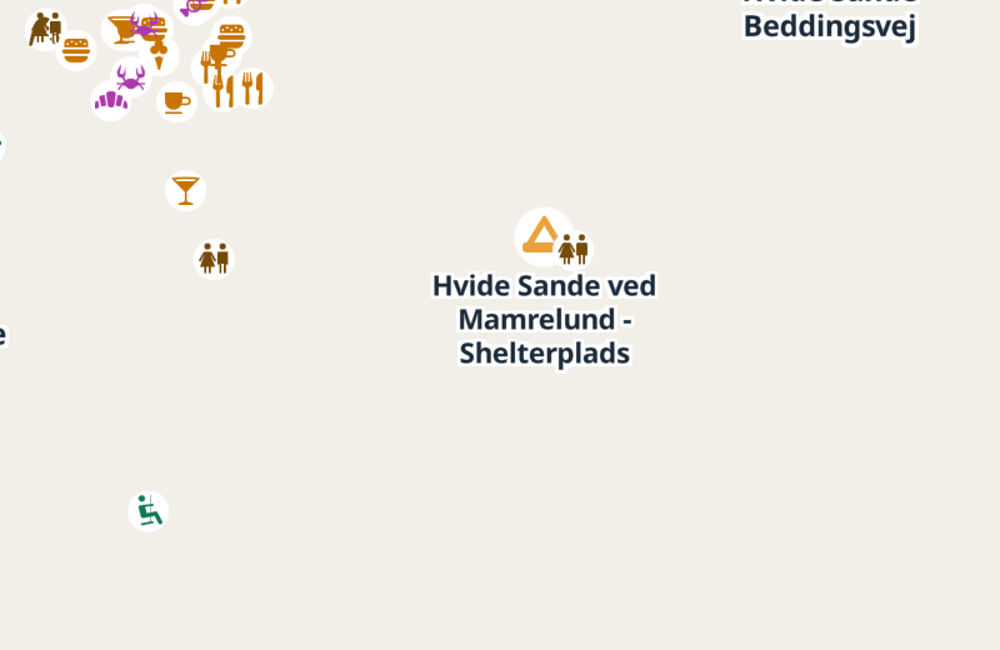
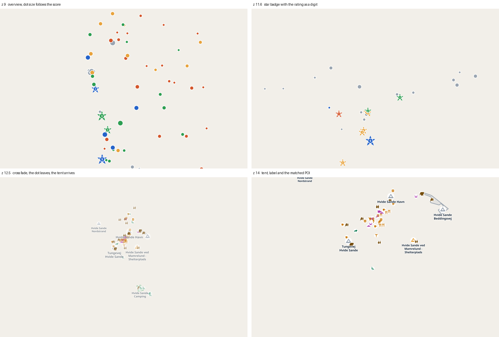
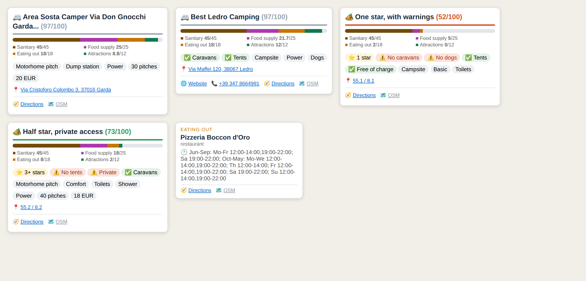
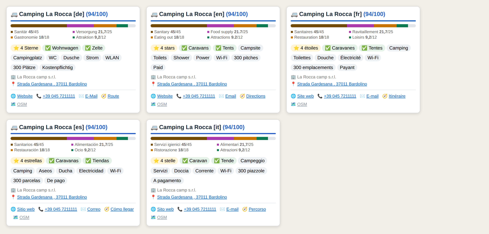

# Campsite Scoring

**Find the campsite that actually has a bakery, a shower block and a playground within walking distance.**

An [Overpass Ultra][ultra] map that scores every campsite and motorhome pitch in view by what surrounds it, then draws the good ones large and the thin ones small. No hard filter, nothing disappears. One file, no build step, no server of your own.

[![Open the map][badge-map]][map] [![Open in the editor][badge-edit]][editor] [](LICENSE) [](https://www.openstreetmap.org/copyright)



---

## Why this exists

Every camping map filters. You tick "shower" and "supermarket", and you get a list. The trouble is that a filter is a cliff: a place with a supermarket 210 m away is out, a place with one at 190 m is in, and a place with three bakeries, two playgrounds and a harbour promenade looks exactly like a place with one dusty kiosk.

This map replaces the cliff with a slope. Every place gets points for what lies around it, weighted by category and by distance. The total drives the size of the marker. You still see everything, but you see at a glance where the good ones are.

## Try it

| | |
|---|---|
| [**Open the map**][map] | The finished map, runs immediately, no editor in the way |
| [**Open in the editor**][editor] | The same map with the source visible, ready to modify |

Both links carry the whole document inside the URL fragment. Nothing is uploaded anywhere, the fragment never leaves your browser. Pan and zoom, the query re-runs for the new view.

> [!TIP]
> The map starts on the Danish west coast. Drag it anywhere in the world, the query follows.

## What you see



| Zoom | What is drawn |
|---|---|
| up to 12.3 | one dot per place, size from the score, colour from the quality class. Where OSM has a star rating, a star badge sits behind the dot with the count as a digit that scales with it |
| 12.3 to 12.7 | cross fade |
| from 12.7 | tent, name, camp outline and every matched point of interest in its own icon |

Hovering a place opens a card with the score broken down by category, the amenities as chips, and a route link that works even when OSM has no address.



## How the score works

Four categories, weighted by how much they matter to someone parked for the night, adding up to exactly 100 points.

| Category | Max | Colour | Full points below | 60 % below | 30 % below |
|---|---|---|---|---|---|
| Sanitary | 45 | brown `#734a08` | 150 m | 350 m | 600 m |
| Food supply | 25 | purple `#ac39ac` | 150 m | 400 m | 1000 m |
| Eating out | 18 | orange `#C77400` | 200 m | 500 m | 1000 m |
| Attractions | 12 | green `#0d7a52` | 250 m | 550 m | 1000 m |

The three nearest hits per category count. Three full hits give the category maximum, everything beyond is capped, so a high street with forty restaurants does not drown out a harbour with three good ones.

Distances are measured from the **boundary** of the site, not its centre. A 600 m long campsite is not penalised for having its centroid far from the bakery at its gate.

Full reference, including the measured distribution across eight regions and why the weights are what they are: **[docs/scoring.md](docs/scoring.md)**

## Languages

The info card speaks German, English, French, Spanish and Italian. It follows your browser, so a French visitor sees French without touching anything.



One line at the top of the `transform` block overrides it:

```js
var UI = 'auto';   // follows the browser, unknown languages fall back to English
var UI = 'it';     // always Italian
```

Only the card is translated. Place names come straight from OpenStreetMap and stay local, which is what you actually want on a map: the sign at the entrance says *Camping La Rocca*, not *La Rocca Campsite*.

The documentation is English only, on purpose. Five translated doc sets means five things to keep in sync, and the second one that falls behind is worse than not having it.

## Quick start

**Just use it.** Click [Open the map][map]. That is the whole install.

**Keep your own copy.** Download [`campsite-scoring.ultra`](campsite-scoring.ultra), open [Overpass Ultra][ultra], paste it in, press run. The file is self documenting, the header explains every knob.

**Rebuild the link after you change something.**

```bash
npm install lz-string
node tools/make-link.mjs                    # Danish west coast
node tools/make-link.mjs 12.5 47.8 12.1     # zoom, lat, lon
```

## Tuning

Everything worth changing sits in one block at the top of the `transform` section. Nothing else needs to be touched.

```js
var CAT = {
  san: { max: 45, rings: [[150, 1.0], [350, 0.6], [600, 0.3]] },
  ver: { max: 25, rings: [[150, 1.0], [400, 0.6], [1000, 0.3]] },
  gas: { max: 18, rings: [[200, 1.0], [500, 0.6], [1000, 0.3]] },
  att: { max: 12, rings: [[250, 1.0], [550, 0.6], [1000, 0.3]] }
};
var BEST_N = 3;
```

Travelling with a dog and no interest in playgrounds? Move points from `att` to `ver`. Wild camping in Norway rather than town hopping? Widen the rings. Keep the four maxima adding to 100 and the popup stays honest.

Adding a whole category, changing colours, swapping icons: **[docs/tuning.md](docs/tuning.md)**

## Performance

Median of three runs against `overpass.openstreetmap.fr`.

| Extent | Before the rework | Now |
|---|---|---|
| Danish west coast, 50 × 90 km | 3.1 s | 2.4 s |
| Lake Garda, 30 × 45 km | 3.7 s | 2.9 s |
| Zealand, 65 × 100 km | 12.0 s | 10.1 s |

The browser side, including JSON parsing, GeoJSON conversion and the whole scoring pass over 2830 objects, is **90 ms**. The rest is Overpass. A query returning nine objects already costs 1.3 s on a public instance, and that floor cannot be tuned away. Everything that was tried and rejected is written down with numbers: **[docs/query.md](docs/query.md)**

## What is in here

```
campsite-scoring.ultra     the whole map, one file, self documenting
docs/
  scoring.md                 the point system, weights, measured distributions
  query.md                   the OverpassQL statement by statement, plus timings
  rendering.md               the eleven layers, zoom staging, colours, icons
  tuning.md                  how to change weights, radii, categories, colours
  development-log.md         every bug and every measurement on the way here
tools/
  make-link.mjs              rebuild the one click URL after an edit
images/                      the screenshots used above
```

> [!NOTE]
> **[docs/development-log.md](docs/development-log.md)** is the interesting one if you want to build on this. It records the twelve bugs that were found and how, the assumptions that turned out to be wrong when measured, and the alternatives that were tested and thrown away. Most of them are traps anyone writing an Overpass Ultra map will walk into.

## Known limits

- **Overpass is the bottleneck.** A large view takes about ten seconds and no query rewrite changes that. A private instance or a prepared extract is the only route below one second.
- **Hover and pin cannot coexist.** Ultra runs hover and click through the same handler with the same template. `popupOnHover: true` gives the hover card, `false` gives the card that stays after a click. Measured in the browser, documented in the file header.
- **The score measures surroundings, not quality.** A beautiful, quiet forest site with nothing around it scores near zero, and that is correct for what this map asks. It is not a review.
- **OSM coverage varies.** Only about 3 % of campsites carry a `stars` rating, and 63 % carry no sanitary tag at all. The scoring was reworked specifically so that a missing tag costs far less than it used to.

## Credits

Built on [Overpass Ultra][ultra] by [trailstash](https://github.com/tyrasd), which does the heavy lifting: query execution, GeoJSON conversion, MapLibre styling and the Liquid popup engine. Icons from [Maki](https://labs.mapbox.com/maki-icons/) and [Temaki](https://github.com/rapideditor/temaki). Category colours read out of the [OSM Carto](https://github.com/gravitystorm/openstreetmap-carto) stylesheet so they match what people already recognise on the standard map.

Map data © OpenStreetMap contributors, [ODbL](https://www.openstreetmap.org/copyright). Code under [MIT](LICENSE).

[ultra]: https://overpass-ultra.us/
[badge-map]: https://img.shields.io/badge/▶_open_the_map-2E9E52?style=for-the-badge
[badge-edit]: https://img.shields.io/badge/edit_the_source-7A8794?style=for-the-badge

[map]: https://overpass-ultra.us/#run&map&m=11.00/56.0000/8.2000&q=LQhQGIAIF5b+GKclq0UpAwgQQLIAKAygJIAqAopEVgPIBKJAcgOKYBuAzBpLewKYAnAA4BDAM7jIAVQA2AF0GjIAW1HDI8gBaj5kJQDsA1lIDGolcPEBLefymiDAE1UB7ea8FbXK-pGG2plr2PABGAJ6QAO46etYOpvIArqKyspFRtlrWBtGpRjkA5pBO8fKOpvwAdBhodfUNjdAQPADqABI4ZJBk7VR4OATU7bStRDwUAoKR5pY2dpCOLuZK7I6Q836F-PJSwq45u5AAZp7RsRtJgoKuSc7iPLZVkABit4KQ5naFntb2ADTRfjWQpaOwuCKQayWTzlAyVQGiJylAzFJIaDw8fgAD1EiXSkAAjAAGYnPMjBDamTx+JyCawCKTaPxqQRGIQbawAL34gOZkAAjilZLZwjxTLIJFI6Qz7JpKdTZO9nkx3NlUVCpMdrAohPwXKIoqJwoCovxREZ-JLKg8oJzLATQvxqb4Nmo0iV3OIauAeLhKCwGCQKERAWpsdCkip-AcDEcliUyhU-PTUbbMJhxOtIAAWACs-iOkFCNyiuUw4AA7Jwc6JiQAOTOOWyiaY8DMd45JD1OpVRIl54mqQEANiHAFJi-w+5BOIPh7OJ1OZ2Ohyp25AppgAEwF4RF4RXYSyPyQcB4zgATjxmFOrhc4nRx7Fdo7Ga7Penrn7hPnKlHS69t+uakgunCAV+P6kmuG6FBImCEo2+5SJAniONsFZYJWlY5qBkDmvIRSoUk8gbm+H6yMuwHbqB-6QGOkCTkB-aDmugLgYxVFQbRG66HoRLboWKGFII-D8OWZ7Ek4laiHmgmLPIih4oRrgGOmb7vt2lHMZAu5sfREEznmf7sYZwEkjxdoUn42iiX4BjmqJ4h6NkRzCByXz8D80yfLccbklodknFpkCuVIhSyjw-Ked5kThpGKjPJMQjhNoRGiKErgCJqnzqO5Tg+jwABatC0Hg1BkDgLDMCwG7oporgCVUnAZk47icjyEKROI1Kic8rTBKJiwbOUHxKIRGo4mU4j-GRGkacozmtsWSIYU66ouLY0RZPKfjUncejwcopQRfIPrzRdmDWYmp1UqkcqZNou2emdG6EtuzUNU1lafDckgnEi-AbscNzRu9VQ-RmdhxoCBgWLyuWWMR8gig5izOM9ajyEE+qQAQtAkDwAAi7UJtDegOVueWOQpz1Zq6hG+IVdp0AAMrQ0j0EQxaREKqSip8kqSICIM+IjwgAPqbOjD6jepFa7iOnBYJexayEkp4dk405JNiCM5l9BZLYI8tntuFCXhQcmQCJYkSZmQjsNYlROOxX2cFURtyxu4A4MSysAEJDoeIgnh2hSSpYRQ+xQ9Y4JwnBE6hhgYRmS3OK2ru6V9H1e62pvgET+YjtuAf6LjGmhBIzuAoSX2Ep7I35z7lY4PWlaXgbtuRG+ATY1ogKzJLfdBD7l44DgeYB3XYhh93kAGI1OSnIIWPWKpPABzsdgfBKUpyq2tJKGWqG5B4wjPFguheZ4MyuEqVwOEN5TsgYPCi9G-K0EQ5VX4IHgbHeAiTcQhrDalxjkRYvgDCimAPsQ43oVCSGZpgIm9AcCtBqrwegRMKD0EgMwHofRIC4MqiQVmkAABqwZWh+gsBoQ+ohAS3BRjkBGMRbC0niKYPk4l5B8mCGfSk+MSCAklL2KQG87TnwCn4ERu1RIrz8PMRYmVsqMJlpoPhKCehVSoTgVm0gQxULwSQF4wYk5VRwMwIg3RKrVSYC8WgPBrLiFpI1JgtBuhTWcpo6my1F4xD1FCIR8RPSmCjHwgAXBuE88Qrj8GgCoHIIJ77HEur1USiQcpxMfKJJJKTdAJIlj8WQxxYnAjyYk1s5htaXUwJk50cQpC5ISdACwSQ3HQPkBLGpgNeLQNFNAakBgBAwPEpUKWHghq+WuE0nK4hvDCGGapMZfx4RA1fFA8SQzxCZBUMk1EEt9j30BIs1wyytDhHcqvVs7J+EbCWdAbWIpPKSHEgMnZ8hwjPPiFoI0iyiJvn5OySIOgpAFk6Q9TwsgnCZG1sTac1gnTjWnJEHEEokjaycDErZrT8l7OhIcwoxzXD3w7B7Ic5UoUzUgHmS8jdJx4htOIaAwh6RrDsOdepPL5oUlcG4xYQ04KCG1rkE5shaWL0OrkVwxxjhCG5ZgfFiSR5aF5R9Rs1K3G0v4FMSIVcPT7X-nyMlm5RCFA1huc5yyJRqgBKoVIshATazEP-bpUyaSmm8CeLMJ45q8p5dKk4ZKHxPnSC0O0eAKA4CIJzCgScsocmBKCPQokIqqVpSSesBtjx4gdSSEcl4Rx4wJhuegXl172wunmm0mBhC7kwL4Uo2ZhCVgLI67EG5WYWj8CwTOyh6nvXkrmFqb4RwdsgPWMdkBLyVg3AHVIhFTDUHNJAegGttjVonRmTgJbx1DkwO2hCpINx4A1vSeQXJA1EhJBmRtb4cyNkwCOZ9s68wLqEA5QVtAUWSgxuOuuO4DaPsnSOEDU76wbiJuJVklpWj2D0NSCQ-EBIjtnRpTgQHcyTsvNwLZFAwHThvQhTgb7CQQd3YeuluGP1bIIDcMZlRfIofmohcjk7737tzKrIkp6tlFXNP+lwgbtyVjfbODSv4qMZnrFBqylJxDsvNBCHYZpxLlwzWpHKolUjPEE6kBMIzyg5CkFoO4dJ9TqTlf4ekyTCLZSJs2RZjzpw705HYKQj11WLwBqYHUtg-gOEOmkWadoybBDvnM-E3Vep+B5DcHRBA8FOPoAMJgWAKBhn1NYdYNnbJiX0HcBwcFTN6AueJZydl5BqAviDctlbVKBqdEojMgTOzKU8NB2DdzIAId8ch3xmAPZ1xQh9A2KEiTNW7b2yA-bRWDsuh7H6Y2qiq0mw3fDHYDPCcDeDIcUgSRVFGxmBu242iDRspSRmWxXAOt8BIBJLgmv8h2wmHE5MNwOXkFETwlobgWc0PSDQJHLpkm3BN61jsOTHCVJ4QEeqNMr3RvhSw3zBQXp7m+Buo3gY7CCERaK9DJug7Y1UEtptWx+RcNqXUHxkf8nkaT3SjdTZuPpPzGwGoyaGHEAq64RF20GwANJlwujmCGGwNwlm-OzwEAApIgtAmBVDdYK48nTULiBUNubYrgABW4gmsa7Z71IoiIPQeG2MyD4zOOxkmJOtlxlIZdRHZzlYN-JMqKRPA5UwRhng4AxylcuyRBAwI1BHzZmBXChH100hwshdNODvs5Q7n03EjKcJI0JUh2dTACroHKzJ35w8EIiDGvmLB+XK+koUIfkgR+KD8OUOkniRswNG2N8bLFMCTvQCg8uKBYEoETDcBXlH8DddfSAoLg-0jlJdfbITnIqdQukvMrPeIA4xqULJKNIgvYVPQoV5oNtklVmVtfNnN9Gw3OmnEK+7BInX8NNY6s-B3CrfND2jYr8v5sw+idy2SUFKE11XCf2v3SQsjXEul81KHlT1A2Q3BuSbjsG6WLEymxEgIAPSQjlj1SAXkagQP5wmWjwzGPmRk+D4Q5H-2e3SRGSmFQ1nEQhwPoN0gbEgDLlQJEQ3AAA08AKE6DX9FdldmcRwRwfphCbMhdIBRdARQgSIA07cSNfNRIRQMow4bsbZRAcheJExEDRI4wNhodbdScKs1JFAxIat1AqgQZZxjsNgwsVCXCk0RApRgB1BrAqg6kPYJsZZlCXDeV3oc5BI9h1YpB2gyAyAhgcxtxVYpEgi7d+RJRBAMJ682xfQWYugKBAx6AABNPrPoJgSAHAEo2gAOIfEfbAHAegRgYxIgCgShPBAxXRFgcYO0HAWVOPeZbzR5C5aAKudkHyMopOeGGBb5YZUQBVKiNML6H7VwcUa+byILYsEiHKOkQ0WVDZWRZGQ8crUVDkbWfzbWWlEvO0IWPQJadAvhbaNSZ4EgNNFTYLJSRIKtBHXQIiFhM5cNE0HgLMCY1sE0QBTGGkKEGEf+RwJDZY2+O470DvSAAARSMQKMgFZgoFYF6B3H9jriCFbGUiECkGPkBG3BzR+k5goQmXvH1FkR4HZWUmdkIJYAoG6BFHsxyip0B3rGgjOUaiiJiNzAoxymOGWkNGNB0VZjKJYGkCqioFoBeCISoGYCcRqJwWdz2kzg2HcgtCkBYCEDUAMEBAoFRBFEWUBBeCMKCEBCIDEBgRcwTEeP5kcFpOkV5xXmjGTykDhidjgmmSqH-UtQtT8ATCiEvTlH5Ccm7HKzjEakR0yNvAIgSQERsn4AdBnxWAX0T0om1GynEWIzcXjAxgCH9xz2qB4EoVAXAU2jUmsDqTkCUgAHIvM-shAokF5RAfTdBPB-T0IUgMIwkOzdDxEtDLseAEwsYcYmQXdSx2clVzUPhpASAYBIAGzRASJXAGyABud8e+PsKcvwV3OXSAO4IwQJXIEUtIKQKuf3L6Y0iOP5DcNYBcpc6AFc7WLc8iTwOtVSPwAMvs8g2gAwAkInUVYvXnSUcEZ4Aga0eyeGMwHwPwD+XgdyAwIgKwnYPAdQAIu0JaSISBFI1wcwSiP8oM71Z2dVMJGIIvZQJSAQNIDkI0OMHPYaWrblLAAVWvZ6HM383soMzQTQ-gNs+sQkVgvEpQRIQkkJeUMJWnBGPdOTEJKKRTHQXTUIMOVGAPBEvADmRo3gZo-BUY7AVmEgLAYXHgespQfQFhOUbwKmDGCUZ2S0WyW4UEOmeGUKJYE8D4Po84psBmVMvNLlPrHafYQ8YQQC9oNw56FYGnXc2XaKx+M4JYf4q4J2RkNwJ2DUQ4JeB5RQw6QWRy3KAwYNAIXIJ4VdUiO0UK9ECKqKgBC8wVBnSkUqhyZYTU7zFhUKNw2RUSR4L0xqI0SIABHQbKb3LQHRTCjQJwXQZQJC2gFCtC6rSasRZ2SrXGWgImUIVmblF4EKNqCJbpT4prXQHgMEeQKwKJAAekutOnM1CCqBdEutX2EB0AMEUO3hBEurcLEEkGACHk2GAB6l+FRBaHz1bNCkUguuuu+qlCqAsKq2sNYpBkuq8MutAGqvCoMEiqmDbMUCtQxrIACogsEsgAAB9QBMAABvccYAXyA5W44AccAAXz-hcBIu2F2KUjUndOiDDKZAtW9FkGKCQq9xnI5C61vFBmekXJMMUnSj0H5HPlf0VrdM8EShkGMDPIBkvJWhvIATvNNPGopsgGptpvEicBdAwMZqZuNtNtykFXKEKEFuKGtttppvOA0wbPfMgFdqpvdqlBBFyDIAlmOOXIbP+AbJ9uZrdtpoDsKCDqlnWFfIbKIGbHkAABPBBI7ra7a46E6txk6KyTZPBLVURs7mbc7JBA6egSl4Jk7+0qtVIfA-hy6ba-bY6q746a6+Iw6cBFIlAjAVIDBW7K6bAu7g7a0-Bk6r4o5URabqSPg0LpxZBAquQR7-bO6E7jYw6l7w9W6Y7FhN6a7jYpBk7d6HJ16O6x6E7F4VhBzchk7hdgQ0ZWhXAtADAjQt1L7D7r6a7pVbjH7n6-BBNdR9726f7q7g7F42pihAG2FIB2gLN+Bv686a72UGQZ9k6GMMH5AUGj7g6761gH6VzX737P7xIwGTaN7f7g7yYw6QG7A8GaGJYQZCtH6OLxJWHrAmHIGJZ-rOEw6Z7SrChV7KHR7eG1VpZk7SGDAVBY8dRV80hRGo6mbxHx6JYq4bAV1k7CMDARSggeH1H05prQKz64QTGnAxHqHeH89VqXB2GVAV5cGVG1GE6XldYp6VyYN1Y9ZDGE6I56EiJ67I5hGrGr6bGigw4dGcgeRJU7AlGIK16XHrH1HMhYUw6mAilBBJRtgs7knwnUntGSGsAwmIGjHvAzQPhk6iZOkcY-Ga6jR3Nk6yBUwjAAV2d6ng6nAowNAdGmKS67hChSnUGJ7vwOQzHQZOmJZMhtQw7WhJSmApnDgv0dgw6SA4wVnnHfaqGCm3HXAnaw7EHnBkH8mymE6TwJBgh7GVz0Jpxn6tmK6UmE61U5QsHZB06r0TntnXG0HdDrmGzhcOGDBhBYdyLCIhnTmRmJYAcFhk76BrKpmzRQgpGSH+BkXOFhn8GJZUyhyw6KBgBMKdRSmglcgGyQZMXmHQ7k6I6VGD6oWASd607dCnIpmC6Vz6AOyWwdQTxukpm4JT72XEM1zxoq0KXeGe7k7WYDgbATYpnJ7BHAmNRbhFhrBRIpnt7k6ABLjwHUL56O8B+luWMO7Vg4X1KZ2+-EohhV1YRwOUZZ0VThcQc19wABlcwmjZqQe10oTzMV9R6B-ZwR7ISrEJHeb1p1yFrF9BzlTxhs7B9gTVqZwhpOlcv+e++wX1hOuh5pmg8NnOp5mu1hmNlgcaJIWwRN4nAR6exViF75-NiewILQFFhsnAVV2kDU2ewoP61sKZzR52He6EY8PV1RutqZJYTUsxsd0VDN4+x2OxwR1SJxqZ9xvWMO7xjxvlkJoJlclgTdsu2lg1rFrnCOGNigNMyoDAtxbsRFnUf5oRoiOGMPIdn54OqIIphssgU17edN-dnZs54+ip8Zrx24OpiN5hxpwDhsigNcmMcoNSp9kd7ppGQu2s256d0ZypsOgASZPESHpH83kATdA94ZmesDmesGABeG4aI-Ufte+zWY2fDx2DQ5Dv2YFYbKwCDbUimYucWVxmTo00lHiDcTlYbdeZXKJvzW6Vzf1d-ahbEFrLDoIGNChKmZhZjceJyE1aUFbcRbRabaIAEaReY5xZ1DxeADUCJZ-btpJfE+k7btk6xapZXJpdrd2ePuTZTqZfpAFVZYg5wDZL4TxGsAAGfh7qP-G67BWlorggvQvmOJWVzaB-MNzwu0GYKFWO3UJIAABD3TdV0aMOxDdQyUZjk+wrhGtICQZ1pN4hlOyBGrqr1LqBl14ws+-C9ZaauzulrF-12Blcgz8VIQP6OVjlTBlcuNpEFLvNtzghy1jz1Nohxr1zv92h1199jrpbx5mblhoKeukt2wKbrblbvhit2FlN6t5jyRytlcgAQd0xKGDPXIa7s+fY0erjfYDmy60cO+He2+MfHZXIoGcmy4zjyeW-pdnZdnnb0dhCXZ1hXeqfh-g+24Ccy+CYu6s5HaPaifG5qWnGUByFKCdm6dSGvfSarcy4fZi9kERbfZwDcR88x7+4A6qa8aSDxMRevlZ+bcDJg4EqXZ6bDsoSC8m8u7Ge54oBw8UGdhQ8saa+mbAVI+kfI8o6WYY7o+TvWZ3m+2Y5gbY4ICG8Z+m+O546ubDpGVmTy-l5ebY7dUqCFku7+dXb8DEB+FU+ssEeC7kcgHopFV0-RbO7q5UiBFCGM4s8omns8FEh+4Pps4bLLaZ+O6c-DtK486IFna5FI5BHWRl98+5-8+hEC-pD5ci4bPoDKDQkz5-Pi8Ul7v7tECr5gTlfS4p-ckKAzSy8YXy+WmTsUZK8T8NfzjDr7+R+O4tZtdq9VFygn+dazZXKn+hm9vB56-vADeTqn-MCb+t9G8D4m48HLYn+tfvuY7n-ffNtH6hcLbDuLaKQO-LbmGu-Y-oS8gzUu4babZwHu6HiEB7fe7DsXWE7y9-upjfruY0zildIefHFNj4EXby9l2MbNdr43l6o9hG1-XdjWxk6vdseMbAgLli5Bch74i0IoIQLJ63tn+7fdeD72RRCAfur3V9jvQz5Udl+zDc5Bh2qaEV-MogTnk0xXI4BTAfMPnqEF1YC8kO-XFYM7Bj4HtmG+wNgdALmQbNr2szZXhRyYFHcoWtHVZpr3V5McB+jnVjgqy37G8oWpvKAauUoiWoYmFqEULQJHY28w6AQBvgQJPCO8FOydIPK73GL795eanRTkIF6hG5-e+nA7iHzD64sdG5nIcqU2nCCpmBvDZPlUFT61dU6gJaYHnzDpvB7wlwYQM+BL5scoOE0YoCwhr56A3B9fN4pmmb75oMuVgARmcDVTd9uexsUrka175yxquc3Sfo1Bq4vcR2-9VrvP0ajkwuuUg3hr1wybEFWOI3HBjgJ34X8sWNXI-kQ2GEOdmGp-d1rsCmZX9k6FpQrDZjErbB7+NQwPkI02Bv9+4TbPAO4E8DeBXQ9Q+Xr2w+7vdu+oPf5mhUnZy9YhRjSAbexgGw84BSPZ3j4zmHMMUBW7Bsjuwx6fCt6kTGNgN2Pb+AG2pAsjukyHhFBaeYdD9rqw2G6CWBLPHeiz24EQciYrTIiOBzB5qDHOgvapoL2uKiscREjcXop3F6KCleJDFXqoN+7HcNBJQlclr02a699B7Ap2txzPxm9k6x1H3iphE79wxODZG3i4P+ZKday7vEiAgNbblCuO8vJFk2wQwB8h23XZhiZwj6A9w+UQ5wOYBiGYD82BOXpiuWvJGARI1OKJOADEjHBCQxwHMNuUyiHFBAwAUAtYE6RRJLwwgbENuTEDIgigUSbcCGMgCVgQx25DhHYEBpiBKgUSQJEoGECblp2No+XMoGTr2jHRFmZ0fwBzDHBtw-AesF6M8DaxfR-owMcGNDH+AkQKIQoFGJjFxjGxiY-gMmPzRpjvwGYrMfSK7o2imAz9MOgWJ3w4pwAxwJ0JwAtrblFQngZ0ZeFMAJxCQI4KsT6L9FIgAx4gIMfGKbERjUQbY7Ah2ITGuRuxSmXsemPUCDioRnwbIMIHPrji8QDoycc6PlQeinAG44sNWKEDbiwCe4hsWGObGRjoxp4g8V2J7GpibxmY6dhpXN73wlx4AUkBIVMCmBtydgbEPIGADHE0IQ9PsQ5DvFWi3OGlG-kkEQlKhBAzo+sKIE7h1hMJH2XCc6HwlVpCJ-AYifZx+YUTk6WEnCXhJFaqQokSDbJmwk4kGjq6hQWrGxzOpQ1LqUQBSVUB+D7MTwD1HwJdWklPVHIQQS6gAH4vC0AQkAADJ6Em5DIj8isZQh0kjtb0Cuhk4AAeIniNHCAnhoAAAIlOBxhgAIpZJOkCiQAlxAgNSstuUOTAB4U2gKJOuOJAHjwwYU2shFL0gHjPJOEmwDyEingTNybkgAHzG1MAjkhkM5NckeTVIKU7kIJRJAHiTwikf8VeP8zHiqgDYVMoxOwnAAuafONWsJOyF+CJAHEx1GkRyDABvcHgFQCeM3K5SMwi46idTSsn8UnaD1GAK+TckAk3JjEJmlWBrB1h6w006IWAlmm2SFpkANyVMBWnM1zwq468KYG2mSpdpNk+abAEOn8sTpa0rCDhFJBXTBUp0qSDJDkjbTnAu05mplJykaRppN0gWndMWnLTVplNSmsHQBJM1h2+Ea6dZLBnaNFpx0qGTDIlhTB4Z700GXNNRkPSJAT06GcHX5Y4zJw0QvwBXUxl8RyZ+EP6ekhk55TLqRPIGRmHynsBCpiSYqV5LNAggwQUSSsKSAXFITqJ4AQkKYG3ChBOAogbcslMBplTIpOYeMdlOhm3TcgpNB7iKSjK40wZ7AeGfZJZkMg2ZeUpyc5BcnczJpzo7CJWDlklSFZaUkSjFNbARQDArUi5JFJVlZS1Zesg2UbPYAmyqGM026RYSKASxvAj8VaRzK5nuTWQrs92cICiTKzGxVs8AMZDzCAzAAvBuAAFXaMlvUlMm5H2XNNDlHII5JsP2azN+kIFVp406OebKKlxyBp58KJCOAPHhiWxCcqJHmAPHeiaxncwkDGKNwigXALo8sSOHNB2yvJqU8qQPNDHZTxpeU5QIFH4DHB3J0MqSeoHEA4zKa6sjshLAgrwz-gRc70N6X3mqR4ZK00aNbnckaN-0RgFafXO5nQyNKF8rKYAD4NwALe7ec5FpmPslXjcgj8teZTSSCvySZ0Layn7P-lZTDZogLKZAG-kFyF5kAeyUvMUTuTZJe466gpKiBw0UKCNHYKxRLqXU1Z1yfgPDOIWU1ayF8-imkR2A3y1Kjge+THLcnPycgRgcia-MzmAAv3cADwfwgt-n-zmF0MkBUzWynfw8AhsqBTAsDmGzWZxtWRcbLdqIybAyMuaR4CuDxBow90tyUPClicIVpZwW6eovpDa4DpOijoXorsBPT5FZs75A3NEDYg4pTgCKZwBohJT7ZPknUOEH8mOBAp7OMBJPNKmOyMp88jsHXLsXcz5ZfM1NILOFkhop5is38AeNTkSypZMs7cqjG7HBB+Z8gSKc1EBlIK-5tpZhY3Ldn0gYlnAL2SDNUXegCgGMbRXI2mQ3D+AT0zOYAAS93GTUqqB1L7Gi08mE9MABfZJ0r2ndLCeZitJk4CemAAeDcABM++9KplM0plgAVf2eFVc-6UzUkW2lvZO8sGXDFdCaztY2shQG2QnowV4ZhSwRYAp0Wiyokx8tSbIHhnnjOE0EwSrBMBkAAKO5UDVEjkKLIAASk2WOAZF-smRbYotnoKU0AsypY2InFOi7lioR5b+K3F1i9xGUvqa7K7kxihwHYyAMSEBkKKA5tcsFUVOyUxL6wPc18YWOcDFix5E8pFX3JRVJyDxbhWHN+CiTZBkQ4kbcqUCUyShvFsOHEAUo0jhLwVbk8KVoFuU7K5p3y-gInQMDwzxwXoyle+PWm1gGw+KkFYUuJXczxVkq26TKqxlCAFVSq-3FSqnEXgLpGquRcKu1XuTdVXyuLLXS3lM1FVutN8U6PAAvTcIeK7KQSsDmmyCpVy+1VKu9AGraZLqk1e6qLEoTpIskbcFasUVhLNVYS2DmHCDXxSJVFkV1fLOnmRSyQ3clOTcvAASEfxpSzuQWs3F9zFQkoKwIJWrWbyOJoSt8PZMUDQL5AssUVe3MjGzzcV+Ky5REvcmpzqwaqysdlKMngBi0rizcoCoMBZT+FhczGXDKZrILQg2y-VY6oZaazRIk9Nsm5KqBuTAQXTZ0H7NXWXV8whs9tf6ubXtrmFXa48T2p9XQL+1oq1ORarxCAzx1k6+NTOrnX5zMxYC7GcuvsmrqHVNIQ1R8C3VT4YKu6-dYepDrHqNll1U9buAvVOBoFl1VtYUtbUtqO1RUu9a2IfV9rilVy1OV6uFljqJ1Ssb9U9S2XzqwFZMoDSBpDVVADV-LMmuXB3WHTYNNdY4ieqymXVEIqGq9Smtw3cz8Nns7Ao+qKXrASNRar6XGo-WUap1P6ujTTMUjwyV1a6sGWGtr6QbONe6g9TxoQ2GzT170ITResEDArU1-AUFYGoHVuSy1zc8lY2MyXABSVAsj6ISCFVvg7altBmszSmxNwTYO4Z4KJBcAYoIiVaFCB7Bth2RcgIybULciHooQJcsW-gJEH0ZHA7a5tPzcYW2YdhqlIy3xMzWk0AL7N0Mm0efVfmAAFalU36r5AGmwrfVrMWEhiZi60aHTMpkYzYZcsTrQzKjk0agVayxmfZwK2Tg8ZtkjoafUWmLwnppWoRZTRHHP1X5gAArI+Ff6hdc1xq6QKtlw2mucDPG1dKhhZi2bVHOfVFSKtj40cTkFW3raf5m2iWH0Ia2IaoFe2pmRmCa1gyYGJ21wHNvO1PzFtV25baIqylrbVNzXGBjtqG0Uz+t72v2sHLBnMp7A02w6VG2vh-biN5WwHdYGEDXb5VIOsHRtrAVo67AUO2dW9tG0fbDtIy7oZolum06AAhDNt+1nbMdoqy7TjtzGvzAAoOTg6TuE-Mnd7Jh3Vy4dQcibVUGO1kwwZx2pnYdNO0lb-tQCnMaIB5187yYguinUgs+1zSFUU9ZnRjpk1Y7ldquonZjMLYa7hd6yi5Wzou3Y7hAoC6nUYveCaKzFuizYG1tm4P9SdCMrrdTPrbnDOEfWkXS9q2Va7HdKM+hJYoWXzarlHO+3SDu12TbLAUesxQ8I91vctGnWpGTTsj1SMIZYA0VOnuAFOAs9KinPcnrz2HTbGLsIvd8NL3i63dlbRafAPT3wD69XSxvbC0WmgjUQ6envYUHb3l7JYletyWqgMUfB6duepvYdN0Vj7uteik0mQp92SoFl8Kqfd7op0-rNdB2hHXNPtH7Q4wPkbReEHsAG6yt7Ou3aAsxkTKLd9M4PWHt33egdWVUqQArpt0A6bRV+l9qYFv3m0rdO+8XawI5Bv7DdF+z-QnsXUs9f9sOynfDvF0yhjAYcskaztAO27wDqs6-Vz2gP36ADXSgEi2GmAh0emo7IeigfP1oHHxX+og5YGwP-6fN4euaTIKEBSxfiZBhbege2XocjVIe6HXfroNjbH9VQbkb0nQnI62Dsey-QnoYPehhDSO-6NoqiD-p09JHUvavsxncig96yrfZbpG0P74DAbKXXNO+2y63J8ujZYrpYWSGMDXTVjnTP0OwNFpJgyZatJNqYynDmhkbdob4O6HcDOelMQLBAPkGP9lBiA5Pv8PfJGtmMm3rQZ8P0HBD+w6PRYbj1X76dKlbYL-uz23TddZik-eIDP3sGQj1h45H8xiP7b2ZyaqnYIZLkkoy5r+jZbaoc0uym5Hss8b5ConOj05Wc3OabpDkoUw5tRiucbO32VHxdFWcaGcBK0NHHNHsitW0eQk2zAlDsmeV7KmWAAj-bq1gyxjXZQQIMYDnDGA1nMq5dMcTmzGh12ERY7mqdlzyr1mcwALM786lBaFDQWWGN5VgbebvPYD7zdAh8u5afKVD47L5LsuhW5NvmMKH5WOl+ao2AUO7H9AAbTcnNjqJ+C+QG5IAC6ycPafCcRNRJ8O4QNExjJslYnkQSJ9CiidRORHCTCJ4k+ytuBuIDAUYFFGibsM1KiTdIfyaSfxOGHxArJ6ibifxPM1AQFO4+TyaiT7BnI1IbWEyeXXCmqTbJvk+SeX0fSoTHxr43oC3VOi6UGmy6q4ZVP-H2N74zUz7pgPSLa5FRg4yUqaNuynNbc0CXPWbmtyYVf430c3J7VDyFOo8-gOPNlnxKglyxlzWwjc2QrclDcS8N5oEPi7tRAjEragpXlALbpkZ73YCdoXyB6Fd88ExfshPZSplgABH2HjSR6ExAZfZ6dA9PB2ddIvgVE6dDZR8M10peo-ko5MZ1eW5PiZ6qwZdZhyNQokOZmspmcwAHs7eZ9-UApEUYHbp7ZpfT+vLN0aqzouxPVUCNENmnjsZxozqA8Ctm5pRozsxCbYWvzAAkOR3aC5MerHcOc4PYtw+guyc5We8PVn2ZjZoBa8edW-G95B8pmkfOY1-Hz5oimhdfJBMMLjA6Z23d2c-kDnUDAO482ArU7nmUacC+dYUtvNuSMFV1eSYpPhqknCFaRChd8ncjkLoZVCz81fOBOgm-zC2siUoGPPcL9zAiwc5YePPiKJzUF009auQUVHNdbU90m2XJqYBrqB0xotERqhEAko+qNKBqF+z-x1UjeIiCKHSr4VsgV5JUP7meBNBjaXFggLGHjBDRF4tyU0rjAAQWRdipwK4J2mhDKBmxx5DEI1F0tKXtTtAH0a-gHawhkwbZfA6NGBJ3gw02Q9IB8QKHIxEQZQ5LTUA4DLR-Qy5SmuNIBJtlKanaNsvmEBCpgnabZWE7Cd-DEha4DU1E4CFhNzhkruK8nGlcgCwnVwgIMkJwFRPomXz40nGibUiu6Q8wMVooHuLyuJXBwKV4kLldhPerCrOV9KzAQ6vFXSrs0cOBIHCtVXEItVtMPFdhM0QsrDcFq+ldYgdWRwrV7q9ld6uQAyrHYPiENfDBtl3oo1uKw1b0jNXWrxkLK2SAWtdWeSy1kq6teNpM0xpnF7U9dADghhg6JRByIfF8RhRfIB0fwB5BhLTAAoQUCiKFFsDhRZQu0Sy7lG+Cwl4oKgKMP5fnJcFnrEsEoq+U4BjSIbPaVEP+WVqUhl4XQzOM8FXLrlI6pwNIPFVFqy4hAzCG3JkEFQFlT4fgOVBDe1gI5DSJwcvPhFpTlUuiqUdUGiE1rfhzyTqK8q+NvImk-kzwQCsBWPygV4gENtqcTSzjys9lcoF0IhSlrzVxIi1awpNU0S4UfehFPTMbSfIyAXyNzYm+jfuvUAvOh+IRMogEYg3pwxwWRA7QFoNRrcg0VCOhPRCRBlcVAfLNdmXlAwrb4gJULsFhikxLcQdyWzTfiBXYWQWFX7N2BcAPYqkXVfsKUBFBboD8iwCG-KwBSzTtgLgcaJ7e0DrAqKVxK4JOM9avQArHwZXKQEoDLlYTDZZ-TsCdaAgmyBIzuwgbqUkoyR4dFck5aBLUHh95QIeuHSQX1IGyAKPmxLDUAE4L6ndyUBZlSGonLbkALi4iWFACw947yb0D0EpCGBLQModKmNTmMGWEwmxTIEqx9Hw2uLHLYwLipygvYLkMVxhfRFphe53Aw0+GybawCSkiAjRbmK+VhPjSIrx9tsllcXFXA2yDZcAIrGViXhB7Q8eK17SR4NlcrN6Y2MLw-z1WW7eYFPnmCIBEPPYKfCXIQ4jo5hyHJDvq+A-0CMLtrg8JCbA5XIIOLYVsbcCg-oRoPq9+oTB4CF5Q4PUgGsfBw2Q9iUPxHKfTgLQ9Wv9WPtDD4wG2W3DMOH41Eth37EDjEhuHlgNB-3oEeBphHeD+K3Q4K2KOjAbZTgKo-eBwPwAsceOInB0eJy8rTZAvZYywc8ojHojtB7nBT5cOI624WR2tYUeQPcw1j1h-A6Lh5gS4AcJx2g4eEGOSMXj+wGg4biSPCQKfQkEE-kdU1zHbZGqxffUfwPW47cTuHE5cf1CI6s+xER4+Sf4PSrxtde8beWgsAB8hRZOhOonhTwMn25K275jxtJaq0oACGyQAt48ECY5qD-IHg9B5g64KtrzMEhxj+5cYFqXQpYUxgWhSOyVK2+gU2dakwyVAtPBHbRhhJkkVdVEH-eWgmUxCr5EKx2Dbu7AokDZNQAUCiQPPB7QB6ia3ZxavPPng93u0ga55POXn1gKJAC7noD2cnGwG26PZINsTvnILnE8-0EASwlIurFF4h2ECD2yRpKQ4MC82dRJIX40w8GpWdhvcIpzzgl4SgORoixEa5ZwNMHxevOV7DL8IJPY7CPgbkcGHYEy9BeOjKgqQ5h6Mh2RkFeXOJ1ZCK42SD2hiKUMVzK8FfjS8qOML54i9DtrlU0QgCOcJ0BC2xxI-L1spS9ecioxUf1PhGqxdRIoxX+rhV1rGZbeLDXfLm4AK7ZeDxgg9gQSg66iTWuXXJhaYqGjFdORygMXKeeaFcvsuMwP1RQPa8RcJamkVaFKCg4XZxufyjLz17G41EJuFCcZIMnuM9dOgf+UL1INSB9Riui3b9e+IDSWSD3ggS6LQCw39eevvXg90WDyAMD1v7wVrp15m-GkilV4Yr3tyoEHvevO3hFTNzbHEhCBUgYrm1IPYKACoLHnrmd1C+5fnVoNi7qt1C8DfCsoSAboVsG9wYiwUM7bnFJ65FLORvJoabhwqjFfmAFU4bzAKtT4a6YRpnr1an9WffSu-gaRVsNDDldiQs6gIEl3K+7YKFWwwHgDz29DR8N3guSz11u-3f3urQxoM1WK7zThAzVg9w5LlkfYlI0kVrtJNi657FG2Q07-ZMSkQ-UviUvSXTKR6JS0utSsIcQHwzNcevEX2oeQN+kCmVBD9yDKF+x84-MeeP-b2wJx9Nc8fm3In5HXC6EmnvJPv1bj1YQo-0vRATz3Z78+7tQIoUHqPpNrCtcWB6PSIKMrXSo8KfRIen8j1C6dB4g63TkWEH++s-SvvwqMElE6nS1yunPRQTwvRR9feATYsq+kC2LFe+e3Efo2srS-GnMhfAxHhd4i46RdI+EcCO5IPYIGuAxXKXwe6ID5j0gowpbrLwGMHc3W7rm97Uy8CdT2ipKFo4MpM41g5Q4yqgITkUEucfBrnTACWC8AMSswA4OAUysFehcGAxX7zwEDjUbddvBXOhXN4i-g+GAD3CkWD4i7Q8YfVrG9ri7g5q8AIYot8XYuZKIL9hRIYebTF7kPjVfgyGMEvFbb3sqLGSpBnQF1O0yXYVQjUd-DV-8TBb8Kv2SGzfEzK8lwbVt2rKgLCR3ALAQgy1LSaa81EAwDAdpybVuvG1W7n7I4J85KAkijkyB4e4QcxfSfcgOL+BMYRJevJyX6qFl3SDZfjSWNx4WwO8sjoNk-ldhTwFByCDvKuw8IUg+8qMB-LKr-oXIpD9hNGB0TvfRwB+SZp-KivlPld-K05f6k7kqzRgpK+YzyuDUJEZV2lr1ejeHuIoEoHa4fFiRBUkdAANS5Smyob0NE2Kqx3w9GybhyD5CdBTAc3iwWQMW-JQ1uFAdb1y+zdcCtvj3AMVeLFtHc+Qt0k7yiHO-EBGBqfpP3lRT6p80+V49PrQIz7uAajIArP9nxFc595F8iPPvnyuSmCC-hfsPqb1CQBjORPft7vwI+9MDPviwX7kVNDH8BJBQgK0enFB+NS4Mw-5P+QJT5XJR+6f1nuP8z+-xJ+OfORNPxn7Dr8sc-IvuUXyrNX1eYEWTWVaUnSTY-eslHsORoiUyMfBPVhE4HJ6Y+me-Aevg3-x6k+0imsWYQH5p-i9xhqPtSYMt0wUDGew5e-qcNZ+hb2BYQv4xQ6v+88rlIA+vjMA2WC9-PMLw1BIvWVTdRLQFL0WA8vKMFD8OwMnxFB2-SP1p9BAGP178E-AfxT8h-bn158w6PiHH9hnK23ulMKRexDwkKS7FPgFpJoCoD6gZp2fIJYBZnaJm7dB0HsGyChk7tyWTu3TZO7MtiadbweP1INS2TG0DJtgd5WT9xpXaXeUZaJnWTo1yffnZ89vK4FyBFyegKlJ+LQnhxBaAY4EkCSAdnyylXyIcF0lTbSADgcKGIrzrtZpMOi3IIvHyDudgUC1GXJ3lTC34AbMb0hBBtjSAGkCVyJBm1BWqSOiMkjJKew0h3ld5VcDfSbsnZo5QfwPbJOyP0giDuTFq3Z9SaTWVCDtjHsixsgyP5USDNZBsisCOwZdS+AggRP34Bk-CwOTpBfCL3sDXyRaiKBHAi1Bp9Q7VaneUsrbcBp8PAKVkqYr4NxFECzA0PEUDTbFQNYA1A45mxBNA2oMKBdA-QMgBDAx2mMDxOYeiK97OE21Zg2AV8kEDeKEQNz9aAmokIBevTvRJpCQQeAsVNgbayW8tggYD4J8EfQKK9f0ePESBuldLXEB3lf0C78UAnvyZ90AtnxNpyrZaFZ5-QDPyqBYrbkz+DefAELqt-SPVyehaaQkFRNYTFqx6CJAj4DgVzg+gHZ9kQ5ckEAFgzYL4C+-JrFitSvRIE8B3lQEJdQxAzsDOB3lE21ZE8VKEGQV9AMEN9xCgbQG3JrAXX1192fCQJcB7JV8kBDYTawBhCEg3oPDw6QtMF5CYQ6EJ6CFAoULxUbrY2neDrvDskJI2Ed5SYRiwEoKSIuLWE3+N-gCCnRNgAOBV8ArCB4A7ATbS4PohOASsAsh6wKoHrB37a5kwptAKoAIAlybU0QhpQ40OWgnAHtB5F3lUIEStdQxYD9D2fAACoGHLOE9CmsV8h9DYQ-0NEBow4MNDCegk23VRXye0PGoucd5U9Ci8bUxaDIAEMNTCWNHIAzCvQze10h2fP-x5R8w6kEeDYw6ENzDQw+MMrCBUKMNrCQw0AgbDdANMMLDww3IGzD2wh0PTDuwksJaCJQnYD6DBIEMPwQ8wjsKqBq4AwHeV8w8QAFB-4d5S0BMghYIhtz0BQBx174dD1xD8eZLSFQOUYMgcA5sZwINDpgdinooNRfqCyBOqNKDzw7AYQAhs4ydFCe8jqIRBnI6dSkFqwm4cICkAAqb5Hhs5Q7-Fhw+IcSEZ9SQjMBNs+uZ2z1xzw8IHhD0kd5QZ1igJIJtgJdUhQ8D7pcETPCdgC8N3ILfan0FCDARMOWg3UI4FAdeAjMHeVCgJSVwjpeOUDQjYTVExeDUA4CKax3lbEEgiOwCQOxAMI9yEoDxuHcJ+Bh6dn3IjvQQ8EWROItSWrEcga+HEBc-DSC61eI-iL11k6TcMIgVLdIBEiiIviOpBZIh9nsBkAtiP4D+-QQBKDxI1XE6RY-cyO3IhfHoPsjxApCMsiGQ7QHZ9YI+iKP1KrJwLgcNI6wC0jdw4emYcDI+SLbJxI04MwB7OdiNyAmCVakeDxgyqySIOwLixfCshfYH-gYwQ4G+CPgTqkoiegtANIMjQWQCMB3lUwG4iMwCQIZ0yo4iJ6CH3JCKcC9haMMEiGyekxUAUUIiIisWEKyKkiyo7cklCSI66w0hTAYyJ78iotnwci-lGiJkiHWQyIUiRw-b2Rh1w7EIT99gbSNUhy+NMBojyoyqISj+ovKyoi6oxP1oinA5qICidI+QNHChQ2iP0iZo+SMQijo1SOai-Is6NUgOopBRNtGoPKPQibolEHkiRohn2ijE-YQAsj-o2P0BiiQkoNcBuomyOF9VrWGMciNIPaNcAHI8aT2jmIpaOCgcQ8VFUt1mDaMKB3lfcF2tyok22wJXyfcGjDAQSIDJj5AP0MBBTMWsk8YGqDiUg8PgCkOWgqQwEH1x0Qxr1cj1UKEOZDaQ2K3BDUQJkMgAuY18hZC2Qr4I0gSY1kVitRQimMgBwgOWKKAFY6EMBBsQcWOFDCgWE31x+Q3K3CAtY+WL1i-Q2qJmlgg95WVjIAOBXCB2fTwMtiuYm2MyD4FIyUT9sCeyTdiuY2mgjB4wy2J9olY6wHZ9tTB2P9jlYssMgAfY9kJrI6kV8gZ16Y7WBRiOwPaPjjmYyKNlDTIprA0t3QOO3eUFIyqz2jc4smmyDqfCXVcB2goQE6D+AUQIBCoNfNHeVLqWEwAA9UQGAAuQYkGABLwVE118bqTu2p87IggOK9SiTKOMIy7J4g0I1KbqBBsCEJgFIBcEZ6Fjxbgs6FeBVWXxGigzXA4HYIzvQeNiibQBHBX1oqFjxxsDyanCIgsCPeIdpKQRLV8QmCHEHvsHrGS2HjoSAXHDJKQFINIMNKeEmWjSDb0hUtDgCCOlioI5aBgi6IhCijd7oqaJOi4AISMOAiIvaOuiyUW6M8xSIj4E5lXyHePsAto8BIZ12AYWMZDVw4iIXgtIZBI2BSY3FTOQqYshJn9SE9Zh8DRQMMByAKEmhJSRvkMMAcVSE4ACYSJiYEnDAKEjhL0ZmEhCJZjE-SkOXJqQ0jg9icE3mOZDWQ8qMzBsCXXzQSFYuEI2BIgBRM3A1Yg6IqikI9gCUT0TD2MOQuIqhOXIdEvkOjCzYiQJMT9Y62M7RDE8MFITLEsxKQULEjRNpDDkW2Jn8KEhxPFCnE7RJcT9QhxXcSeE4xI0TE4wBLGgBWVaMCi8Y+KMUiwkoqlKBpqOwF-imKZu1hNxAbAm1NJEiEIHgVEksKySRYrQFat3lAxN-8bEoON0hAQYpIYTSknhPKTtwEqx6DkcNmI+BLQK4NnxaQzfgSTr4ZJN2BcE0WKMAZEgBLJDWYk21Z5qQj4A9iTYPpK0A+owZIkCcfeQFxiagzpJQ4kk1S25NefGK25NBAFiIuiFolZMST+AHpI2TNEynT2iDk7pPWS-QouPUS4QmUPTisYwWClBRg4GKGSQ0EZPZjREgWI9iAHWNGAdpk6RKljbAniOciHqdfT8Aog35KAcQwUULBTLAIQ2GCXkuFOH1OECYNxU9kvoKhTgHUUNCTbwckJNstY6kK5ifkwB3+SpEsWMGTgUrRKBiWNI1khTSUmFL1jaU1sFW8jI9QJGCtA6oNRACY5lJNhnYvQPRSCErFMZTTk1GMujcgCB0Yd6IcJ3UdWnCgEKIYfNOK-jv8Y2B7RewAmLVCko5KO1M3JHMCIAVpBMF1TPYFaSdA1bQ6RzBdfNyWyiNgZcgvgyuQwK5T8Yu1Llh2fOB1yC4krRQ2AqgCclj9LqRuPeVErYADzAWI95V0kokAAB1PYUmiIBSaSNOJA-lXSQAASS6kDisElQAxShQnIPmi+gy6neVI0vMGjS-lZNO8JPMdvzzjDAlQGuTdfFcl19I6NskrTvEtOONocQdKL0BDlNcgUBMYhPxlUMwmamJjlof6mbtcreBAFZmI6m0GhR0zRMSTRAOwkTInIUGIKj+-Y4FkSTgCCmhgIIs2JNtbRZ23ZQxjQiEYjNZSmkVS3wSqI8jQEnyDQiGdM9Pgjpo36M8wM0kiJ8SaUzmUhSsAgolhML4dgBYi3kjsAvgimVP259P0zRJBSaU1wBBjqjcOXeAIkuGn7ia0IQyKYWvD9KqAv0m5Ja82vDry69TKJDNMBgMiN39I+uZYLNjzA7EE8ShAZdAwTr0vCNtjHEuDL+Mi8FMOnDJxTiPCBrkkMMJBPTcpPYyNxQIIvh3zYhnzCmMkjKai2MjjJLCuMojMyiJI6yM+VZ8MKIeoNY7xQjjIgBGPmh7UKZMkiwY2JMRjxUs2NgNzY3AEIAkM4xU0Vv0-6mhiN05RUZsbcKTKkjl0iaI3srbYtgU46qYRAJgbw7QE6otoaKA4offN3G2gnoQdJuwpAERHhtzAzLFZgKEFMJwALgsTJEpXFN0LiSRIVwWh8egkdIXTwY15KpTzAufAYyHQ1lUJCL4ITJasSw8LNZhw4hsiedSk-MPyzBAHlKEzaw7U1KytM6iKSynAHn3S10TNCJoiAvdrPCBM-ZiMyDzM4GPsye3DOPi0lgVZIwSDE+hIMBuEthNYSSMldI+j1iSiLOQ7YYK2PThk4RKATSE6rLLwqkgwAyTsACgAizYYwoHdjcs8ahqzikthJKyTssrO3JzsmRMCCmk6CIoS9shBIOzIgRrPuyzsyIC5DIAD7MJCgkn7NOzHs8IEpTAg7LOXJzs0pIqy9fG2EET6kCQLcRxIEf0vTWsjP3Z9jMHIA1gJMh2DRycA18i80ocqglfIuokZC+Bus2sixyJMvTKRiSIFGPGkzM6PzeCxsxP2qisshG1tFho3dJuR908QE3TloJggFZ0Ex4OGi4IqjOazzA5lF68wrfaKG9waMdPG8THHy1yV9oiKM-IPkifS+TNAWkIbtyACgABTNASHIugTbVBP8BYTA3MoBYTeQAaTAgixJdjNwLCOTpF4DqMWB0JFjWdINM95WmtYYksHNAjAOyIzAUo3EBixeAJgCoBQ7dwCQU9Mk2xKTXyThLoSPE5ciTyWEmxOXI+E2hPTygk18izyBEs2NezPktpPESQEf+EFpskwFJXTDoikLIzuTUxOKz9EnIFsTm84xLrzdEiTIsT28hvPRN-E7EFsTbstBO7z9YzvO0Th865KbzZs9nzcS288vJCSHcsfLnzTE2sL7zAkgJNnzdgefI0g48siKRAofNEJdC4smiCFyPgcMT4JbUvfJLD8w8MCaCqgFR0BzpwqsK+y6w-MKdCxM7kjXCkFC5M8wDs7Alpoz8mbMiB-8vfIWz5Ew8T4IFs1RMPF8iViLZzHk95QFBq8hG0ORU8-hK4SJMovI+AqQ75LLzek8lMlikC8wOuYRqRUIcha8pfNysBQKoEWz8c82M5CZ-afMgRXyJwDpzAgk22OBWk7WPxDpkJ4K6BYTKgpBDiQhgtHzE-DgusT40j3NMB+C7pVRNzMjguly4Yk-IahygY0QSyOwG4KaR7gv8N4KyAWAoBj2cjALYLloR8E9TmUf4KNxlw8GJVDQgEoL2j6-WOjsi-lUnNBwWNV5CrisrJ61sRkbJwq1TIAGuO6ZKgRdI4jaUQxIgdxUm1OrTGxF83RSJMk20WQjvS7O9TCwg4MuBowbU08KXrBQvrQW7A1QRyich-IdCmM+IqGgQw4ENkLwwOsJJBOMtQuBR3AQgjUTiivwFKK+CkEPDBdMhQrtS4sZcgEzqcRwLqLZADovwzlyQjPejjCnkQu8XkwYsVBlyZyHuV3gM2IvglwzAFfJZi4+wWKWNTgtWKP7NjOghSk33NAh-8ljTixYYq2zzJJUXGkUx3QLyjhIkPc9j4QkFC+C5BOC95RLRaaLYuMB4wmAlKTOimkF6cQ87U3EBwgNqPvh6rFIiBMsC6UGPhtiBqCfCZY5aGvQVi0aDVTpwDVPMSkIrkDEjaU5ci5AlC4FmXIf41S1KiFCiQOBYkC3jKfN6MgovGomM4FlYyiQUTJdDPTCTPJLPjPU0SKaS4QGEz6SkcE4ymS2PKQUuLMgFsAw4CQQMBdiVIlyZ5yXLGMIb7T+LfAuLS4SaUEKZ-yOA6GKzyOAJlcWEa9Rij4EaVrhZUrJjS4jRVMUoEhshq4o9SOjQi-0qbWajcjS0o4sb0a0on5ptZOlOJA6a+Dl4rSsFOdLmo1SHSB3U90In1XWC+GO0ogkMr4QpATwJaiNyJQs1LDS-fRrwj9bCLtL1inpWXI9SrwGVLDA55yuFMy3wDrTE-OhmzLyYAsveVNS7MomUCys0voRqfZrMcjxpZS1UtUIHokSApyIvBUQU49GDUzxYGMDWjcgccnNA7baF18AGy7U3lYjva+22JKgQPDcAlS10BUpMoAyxsQSAOeOUB+GBYD6Ip4wW1HL2yV0FwoziC4AHITCafAWA5UfnFCyEbRhAFYWclcyEAgi3ICJL848IsiSRI6JNKiQE+CJp9yUlTOyyxIW0WVzRIORgEBrmGopZzu-fQvgLOcp9PfLJcqN0ejTSnpLeizc5aBIzlyCXM8jwgW9LkjPMWGCDxXyLOM5wq43nJuB+coLCqAVbLIveTtsrAt1zS8q8uNyCCn9LfBRkiJOEj1ouq2VDdMevNkLYK6YD+U6Y6OMZjUgNxFoLMCsWN1ziU-QAryCk7cn1w5k5yJxiDAPGOYytk3WN2TKrTstfI8aXqQDyLQWDMuhKolOOxySpXHNTjLoE2wMAy4fCrVpCKzirPxYUvnLIyyKiitoLKogwCDxL0yypuT3KwSK8q0I9yoRTtYDlJCCA4NFKHB-KgOECqNArQPcqwq2wtTIk0JwFZC+onTMGj5oPTL0z2QKfHMzeo8aXrLtUkhGPgviGy2Rx6KubGN8+YBAMiBLiZMkUQwSV+wvhxpLKrtTYQe8sT9rC+KoWj7qRyv-gyK4P39iZ0nqoFyNixwp6Dp02dLn8BWNTNslVIKnOarms8au6ZyfN5HRCEq4CuzShQ6dPXDH5GJGVRjQQkhiRxpWmlrI2yIeE8JdMJBR8jt-NICQVDkFLxGkmobgA0hacHeHisETNIEM14TcFEM0lpOLDRN0rNySZ1PqtyV4rwgVqVIV-qw6R6S0TVEweK1nXJRezuWP6huU8rEGp2AfqxUDRNEatIGAALkILm+Q3q+1lWj0dAGsyVWwSGvhN7qyGvBgrHShPBhKwAGqJrCBKxVJq2Ecmtas0alE0BBfqmkEhqTrBqQKcLIDq23B6k2GqOqoQHFHFhcakiEyVLq0hTbJZajSDuqyUB6ppqkFF6qVz3q2QGBrvq7mplUKawGvckAa0GvBr3ISGrcloakqzhq8XQINc0rZVGutwMa++CxqLoVzV1VUapmuJpgasmsEADax2r1q-q3Kymta4UkHYhYa12oDM8a3E0JqGOYmpZrUan2oNqqa3KxprCrWuA+gGaokDFqOwY6slqzq1yEYQ5a9yEcsgSzKFkBbqhxXurtrTVHVrby9Ry+qiZAOt5rw6t8D5UWEXavmhRS4ACMttgXdRjdVWCUBaUHckZCWMY6neDjqWlVmretfajmuTrAQG0NRrLUgGvDBgaz2pJqE6tmpnrja9GqbrRIPmp6sQ6-mvrAOayrx1rG6qvTJMOrPMBzBCrEqyvrg02uBSL4TJetRqV6xmtjrmayeo3rp6v2p3qq9QOrTrsrbcBHBD6jqwtCT6nqTPq8jPWsvrsrHMEvBb6oOs9gH6pqBAbF64GrfqPaj+q9qp6xyF-qua-+ubrAG8HFAbsrPMErAIGtxCgafq5yD5qqgHMFpqWrJBuMgrai6C7q3CGtV3VUgQajyNh61SG7r46GkDgQYKbpFxpBAK1AuhAS4EtkBAaWEGABQUN6v9rDpJ4pdre4eGo7qNIdhvCNFM4kAHjMAXOtOr6EQGlGgi6kmikay6iuuxAq6pqCgxnquureqnUaht3qWlDmt1qL6mGqQU26kiA0aT0kep7qSaRo1+dRoK1LYaR63NSwbx6z+u9rN6pOpVrIahevhNMG+EzXr46+E0TqOapRp5q96oOvmtfwUhobhwMShq-qG66BvcaU647GJBM6phsfrl6hxVXrsG9erSaYmjJr-qsmlxuIbPYBOHyb6GlhoBrT6gGrcalpWBumtiQG+txU761BtqbsQepsiacG7+rwaWmghrab96uBpSKhaqbHXFj6vpsgaBm8+qGa6GuTBSKmGlus0aR6jhvUAuG2QB4aQmzur8bBG0SGEbJOaJCBwJG+aHMaK3CwpwkFGh2taaVGk5ojd1Gvhrdl7a+E0ybMa-5p4izm7RrHqhACeuiaf62eriaU6j6Fpq1mjOtvqgWtzVSBXAZGvaNDpacU-F5UG5tOb+GnQCVAnFCKSJA9G-2JOqpatqFIgNIK6veby6pWsrqVa6uutDa6unDerBm-WohafeY0HbrMW-xr7qCXfzEEBB64lt8b+G8JuSaGm1Jrcl0mgGrnqp0KZpmbYWqJtwb2a7eqWa+WjptRbQ67Ky2bUa-ptRreW2BvzUxm6ptvQ1W9+tmbGmxVuaadWmhoAbKE8HDQb1mskHAbtmqht2bSm-ZqQb4GxBvTrycW1oiaNWuZqaaEW51ucaVmkhr4x+a8hqKanGspo6sGGxBv5aH3M5qmBOGw6W4bjQXhtCb+GwOiEbJ6URpebg7N5tLqPmuRu+bQW35vvl+W+TjjAfGyFv4aQWzmqdrtazNqhAoW-GsUy5W+1oValW1GpVbU6okBDaqmntq7qyWnFvtq3JAlsJapWttrdlZ2ilolVdIaloMapak+lMaS66RssbrG8GFsbyIextRrHGv1pdaiGs1r2baG1htbrBW7xsCC+JbyT+BYURRtaa7259qYlkpN6tVAAEZISkAA4e+EmUe2l9tla3JFJuKbHW6NtHakW+eoBqgwwzXXE1sMNsHaI2h1pHb623Vtdb+ag1qPrk2y9pga6G6+ozaam1GqQ7a4EcFQ7X6uprtaMO4dqdafmnDuvb+a4BtIavW9WJNadmm9v9a72tNoQbxmiZvBg0G+E0o6iQajsE7EmujvDaRATVvmbtW5jqvbsmjpvvzPWz2AoafW6DvNa6G9NqE772xlqYkKgXz13UFPIQGXaoYJiTPKCyeKxOswOqzpzaLmvNquaC2izswAX2ktoeay255u0rAg5ltkb-4eRrc8lO7mr+braltu-aWpedsXbPxNzq0QWpKOtFAYWuTsjaYOhZuVb4Ox6trhJ2jFvFraWs6p5VTAPdpUSD2pWpiZ2Wx6q5bXq3juU6XGzxsfaEaotrdkRWw6X7qJWk8Di6u6iDqg74W9Lrg6fAampRb6OlLsw6mO7Dtq6428nDU7DW6axQb1xYbrhatWrepC7CGlTrdaIYabqms78gzula3Zc5ucd3q65uFb7m7sW86W2itr87q2mRs+agugds7bQuxtvC7Gu25vbaUahdsJaiWzFsS6Ca2TsW6FO5bsprMu8dqmt0WrOq3aJawxssBWpe4sZb5akrosayugwCPaUWqrs1reWwOvq7wgIVqa7u6tQF7rWusVtO4h6nHu675W6Dqw63JMdqG7fu+Tqja+u8btjacmuBrGb1OysDOsJOhbtp60uxToZ7Vu9pvW7ZnDjutCKG6duzahAXNsO7XO47o0tTukRp87xGyto0h-Om7rrb7u5Rse6NIZtue6SW4FpRree65W7avu6Fpp7Uuinqp7moQBvpra4UXtJbsW3FqXF8Wj7uOBOukerXb3a87Dy7Ja+BFwluEYruZbbq8rp8AOWp6tPbuWmru5rTAVRo7AvG7Xt27ceoMlFbXncVslbMW0nqHbyesbsp6ge6ntOta4Ap1OsPWheq9acwG3r27HOg7vza-wl3uLaTux5ruLzu3zskarugLq+bgu6Tv7hgasFvNrlpdiG5rjpEkm5rHpbLvGanu1toqiR66Lqd7q+vbuN70OkbsY7YOwHoG7kWi3rprQe6EPB7aW73tFK-eq7oD6keirrVq7GsPpKaMaqPozAY+sfqzbi2vHpJp9e52HP6V20epN7Ruxfqz7l+kNsYb6GvPrTbBaovs9h6kr7vL7Lmo7px7PO2XqeaG+hXsu7pGlvtu63qn1M77WmyPtyslpRwEM1aao6XM6B+wmVKajmptsBacejtsQGY2mfW770B7mtVVNpH6v778Wt9Uj7B+vZs9VsIb1R+q+IH6pjVvpbcA4Hx4SeGnhH+8fv4bvuu7p66lu2Jo-6sutfohhrezfrzqjGs4t37Sut8GVqg+yruP7qurEw+qiOvnoNrBmlWw8aNIS-pgGy6uAdV7Mm4PwEH3On9rfbJa-Xv0H7OlqV-bUa-9sahAOrghA7LB+Lt9Nkuv7rp6eetXuWamehlEFqZu3OAcGcJazp5c8rLbo36LoF9uM6He5swuQ4ul9ouQh6Kdwu7NewgfmgX26LtSVpZUQBSGmJNdsn6PuooZak3ejNWUdIuiIdn7IOsnt67-B83sYacusHpABgAUAFhN26w3FUgYQm7Hbr3oFq1hNQgLAklURh1wGxB4ZJpxCDQyeE2MztcNyUHVwUtE23IP6QQDmHndBYaWGJ+KPRWG-lPUORTBc0AHeVDh7ciylNyfYaykHqFgtABoGaoFMAnAA4d3SnQMaTWHYTAAD83Jf1PGJRQUmhtRSaFVFJp5h9NMTS3JT4f9SHncQD+GWeUmnBd+7Lnj+GYXDHxP8DAUmmx9VLUmjx8yXKuG0BSaMXxgpSafPzjBSaM9x6RXLUmhL9SaMv2fdSaIQSEBq-cSExG6-WkdbASRpvxg8AR+l2J8-h9EEl82QHYApGJXcZA2QWR4YnCBaRxX0GhSaXV1RBRvWEaRRYRu1wpG3XNxD+Gjfe8ExGUMaYEFHzfDN21HrfSd22AoRstx9RSaJ320Bj3EkZuAPfckYHdpR0b3FH-fJQFkBSaIPyMBMRqf0nE8RwpBw8F-NEaI9wAv4bI9V-XTD+HW03fxY8SRnf039RIKMY49j-ceyrRERwH1Jo4vVMj4Rr-QGFTG7-HpDggTPSMas8ggV-0+baRjzyORXPcUcADoWYAMKAgR4ICi9AxlL1THoAkEbRNOK6nFVwbgJ0DzVSQS4dVxpQk4eEBqQ2mlOG+x+BFeHQyVXAOANh40pUAwRr4ccD6xsALuRSaJscy8UgbL1bHUTJ4fkAJxwQCnHrANJsqQEkecf9SFvL0aw85-XDzKR-RneGi8gxuj3LHQx9f3LyYx-gDjGBPPfw-GEx98OTG4YVMdhtL-HpB093xwz3v88xx-wLHzQIsds9-4Usc-9yx7zzNHPANxGrGWxItLRMnh2QD3GDxrE0GRvkU8aJC93abxJGj3ckcpHqR80BUBaRqvx-dGRklxZHBANkfvBoPK4HkAMJ7cauHhAQoBwn4EeExtRCJon21GJfW5H5H5AHUbWQyCUUZSgJRmUSYmZR613lGRQRUdVZxRnGHdc1Rv1w1HI3bUfTch6GSYNGlAI0dTH7fctxdHzRl31DQrR933EhLRu0e9dpRid2dHXR9eGD8OJp4aOG1h3CYRN8JvE3BG+irEShHPnWEeR94RneERGUhcIFhcUR28eYMFkpkdJdTAAnzxGpfVd3zR3JricfTDhqgjgixpVXCQwJXDKLuHjAqJFrJoAWslEDAQKJC9czw4ZBoJasuCNED+KheGgAaY0w3hhIa9gFamZxkxTnHcrVwG6m3JCDNqMVh0AE6pcp0AFVxKIGXyKnqSEqbKmKp5qeqm4IuqYY4aIs8KanYYQafsGhvQaZVRIagabanhpqDNGnxps8LynuJ3yGFdZpupGqmFppwEqmSplabM6GpjacyCtptqZ2nNwQaZ+GCJ-qcGnjpx+FOn1iCadVx4Ka6Ypg5pu6acByph6aWmapnwFWmd4daZ8BNplqc+mOp3Ky6m2pgSf+mjpvo1LkTpppzOmfAC6fi1CpyGdunSpmGcWmqphGZUAkZu8san3p9GfhMvp7GbwmvkPEzxn4TQGZNhgZvQAmmgAA
[editor]: https://overpass-ultra.us/#run&m=11.00/56.0000/8.2000&q=LQhQGIAIF5b+GKclq0UpAwgQQLIAKAygJIAqAopEVgPIBKJAcgOKYBuAzBpLewKYAnAA4BDAM7jIAVQA2AF0GjIAW1HDI8gBaj5kJQDsA1lIDGolcPEBLefymiDAE1UB7ea8FbXK-pGG2plr2PABGAJ6QAO46etYOpvIArqKyspFRtlrWBtGpRjkA5pBO8fKOpvwAdBhodfUNjdAQPADqABI4ZJBk7VR4OATU7bStRDwUAoKR5pY2dpCOLuZK7I6Q836F-PJSwq45u5AAZp7RsRtJgoKuSc7iPLZVkABit4KQ5naFntb2ADTRfjWQpaOwuCKQayWTzlAyVQGiJylAzFJIaDw8fgAD1EiXSkAAjAAGYnPMjBDamTx+JyCawCKTaPxqQRGIQbawAL34gOZkAAjilZLZwjxTLIJFI6Qz7JpKdTZO9nkx3NlUVCpMdrAohPwXKIoqJwoCovxREZ-JLKg8oJzLATQvxqb4Nmo0iV3OIauAeLhKCwGCQKERAWpsdCkip-AcDEcliUyhU-PTUbbMJhxOtIAAWACs-iOkFCNyiuUw4AA7Jwc6JiQAOTOOWyiaY8DMd45JD1OpVRIl54mqQEANiHAFJi-w+5BOIPh7OJ1OZ2Ohyp25AppgAEwF4RF4RXYSyPyQcB4zgATjxmFOrhc4nRx7Fdo7Ga7Penrn7hPnKlHS69t+uakgunCAV+P6kmuG6FBImCEo2+5SJAniONsFZYJWlY5qBkDmvIRSoUk8gbm+H6yMuwHbqB-6QGOkCTkB-aDmugLgYxVFQbRG66HoRLboWKGFII-D8OWZ7Ek4laiHmgmLPIih4oRrgGOmb7vt2lHMZAu5sfREEznmf7sYZwEkjxdoUn42iiX4BjmqJ4h6NkRzCByXz8D80yfLccbklodknFpkCuVIhSyjw-Ked5kThpGKjPJMQjhNoRGiKErgCJqnzqO5Tg+jwABatC0Hg1BkDgLDMCwG7oporgCVUnAZk47icjyEKROI1Kic8rTBKJiwbOUHxKIRGo4mU4j-GRGkacozmtsWSIYU66ouLY0RZPKfjUncejwcopQRfIPrzRdmDWYmp1UqkcqZNou2emdG6EtuzUNU1lafDckgnEi-AbscNzRu9VQ-RmdhxoCBgWLyuWWMR8gig5izOM9ajyEE+qQAQtAkDwAAi7UJtDegOVueWOQpz1Zq6hG+IVdp0AAMrQ0j0EQxaREKqSip8kqSICIM+IjwgAPqbOjD6jepFa7iOnBYJexayEkp4dk405JNiCM5l9BZLYI8tntuFCXhQcmQCJYkSZmQjsNYlROOxX2cFURtyxu4A4MSysAEJDoeIgnh2hSSpYRQ+xQ9Y4JwnBE6hhgYRmS3OK2ru6V9H1e62pvgET+YjtuAf6LjGmhBIzuAoSX2Ep7I35z7lY4PWlaXgbtuRG+ATY1ogKzJLfdBD7l44DgeYB3XYhh93kAGI1OSnIIWPWKpPABzsdgfBKUpyq2tJKGWqG5B4wjPFguheZ4MyuEqVwOEN5TsgYPCi9G-K0EQ5VX4IHgbHeAiTcQhrDalxjkRYvgDCimAPsQ43oVCSGZpgIm9AcCtBqrwegRMKD0EgMwHofRIC4MqiQVmkAABqwZWh+gsBoQ+ohAS3BRjkBGMRbC0niKYPk4l5B8mCGfSk+MSCAklL2KQG87TnwCn4ERu1RIrz8PMRYmVsqMJlpoPhKCehVSoTgVm0gQxULwSQF4wYk5VRwMwIg3RKrVSYC8WgPBrLiFpI1JgtBuhTWcpo6my1F4xD1FCIR8RPSmCjHwgAXBuE88Qrj8GgCoHIIJ77HEur1USiQcpxMfKJJJKTdAJIlj8WQxxYnAjyYk1s5htaXUwJk50cQpC5ISdACwSQ3HQPkBLGpgNeLQNFNAakBgBAwPEpUKWHghq+WuE0nK4hvDCGGapMZfx4RA1fFA8SQzxCZBUMk1EEt9j30BIs1wyytDhHcqvVs7J+EbCWdAbWIpPKSHEgMnZ8hwjPPiFoI0iyiJvn5OySIOgpAFk6Q9TwsgnCZG1sTac1gnTjWnJEHEEokjaycDErZrT8l7OhIcwoxzXD3w7B7Ic5UoUzUgHmS8jdJx4htOIaAwh6RrDsOdepPL5oUlcG4xYQ04KCG1rkE5shaWL0OrkVwxxjhCG5ZgfFiSR5aF5R9Rs1K3G0v4FMSIVcPT7X-nyMlm5RCFA1huc5yyJRqgBKoVIshATazEP-bpUyaSmm8CeLMJ45q8p5dKk4ZKHxPnSC0O0eAKA4CIJzCgScsocmBKCPQokIqqVpSSesBtjx4gdSSEcl4Rx4wJhuegXl172wunmm0mBhC7kwL4Uo2ZhCVgLI67EG5WYWj8CwTOyh6nvXkrmFqb4RwdsgPWMdkBLyVg3AHVIhFTDUHNJAegGttjVonRmTgJbx1DkwO2hCpINx4A1vSeQXJA1EhJBmRtb4cyNkwCOZ9s68wLqEA5QVtAUWSgxuOuuO4DaPsnSOEDU76wbiJuJVklpWj2D0NSCQ-EBIjtnRpTgQHcyTsvNwLZFAwHThvQhTgb7CQQd3YeuluGP1bIIDcMZlRfIofmohcjk7737tzKrIkp6tlFXNP+lwgbtyVjfbODSv4qMZnrFBqylJxDsvNBCHYZpxLlwzWpHKolUjPEE6kBMIzyg5CkFoO4dJ9TqTlf4ekyTCLZSJs2RZjzpw705HYKQj11WLwBqYHUtg-gOEOmkWadoybBDvnM-E3Vep+B5DcHRBA8FOPoAMJgWAKBhn1NYdYNnbJiX0HcBwcFTN6AueJZydl5BqAviDctlbVKBqdEojMgTOzKU8NB2DdzIAId8ch3xmAPZ1xQh9A2KEiTNW7b2yA-bRWDsuh7H6Y2qiq0mw3fDHYDPCcDeDIcUgSRVFGxmBu242iDRspSRmWxXAOt8BIBJLgmv8h2wmHE5MNwOXkFETwlobgWc0PSDQJHLpkm3BN61jsOTHCVJ4QEeqNMr3RvhSw3zBQXp7m+Buo3gY7CCERaK9DJug7Y1UEtptWx+RcNqXUHxkf8nkaT3SjdTZuPpPzGwGoyaGHEAq64RF20GwANJlwujmCGGwNwlm-OzwEAApIgtAmBVDdYK48nTULiBUNubYrgABW4gmsa7Z71IoiIPQeG2MyD4zOOxkmJOtlxlIZdRHZzlYN-JMqKRPA5UwRhng4AxylcuyRBAwI1BHzZmBXChH100hwshdNODvs5Q7n03EjKcJI0JUh2dTACroHKzJ35w8EIiDGvmLB+XK+koUIfkgR+KD8OUOkniRswNG2N8bLFMCTvQCg8uKBYEoETDcBXlH8DddfSAoLg-0jlJdfbITnIqdQukvMrPeIA4xqULJKNIgvYVPQoV5oNtklVmVtfNnN9Gw3OmnEK+7BInX8NNY6s-B3CrfND2jYr8v5sw+idy2SUFKE11XCf2v3SQsjXEul81KHlT1A2Q3BuSbjsG6WLEymxEgIAPSQjlj1SAXkagQP5wmWjwzGPmRk+D4Q5H-2e3SRGSmFQ1nEQhwPoN0gbEgDLlQJEQ3AAA08AKE6DX9FdldmcRwRwfphCbMhdIBRdARQgSIA07cSNfNRIRQMow4bsbZRAcheJExEDRI4wNhodbdScKs1JFAxIat1AqgQZZxjsNgwsVCXCk0RApRgB1BrAqg6kPYJsZZlCXDeV3oc5BI9h1YpB2gyAyAhgcxtxVYpEgi7d+RJRBAMJ682xfQWYugKBAx6AABNPrPoJgSAHAEo2gAOIfEfbAHAegRgYxIgCgShPBAxXRFgcYO0HAWVOPeZbzR5C5aAKudkHyMopOeGGBb5YZUQBVKiNML6H7VwcUa+byILYsEiHKOkQ0WVDZWRZGQ8crUVDkbWfzbWWlEvO0IWPQJadAvhbaNSZ4EgNNFTYLJSRIKtBHXQIiFhM5cNE0HgLMCY1sE0QBTGGkKEGEf+RwJDZY2+O470DvSAAARSMQKMgFZgoFYF6B3H9jriCFbGUiECkGPkBG3BzR+k5goQmXvH1FkR4HZWUmdkIJYAoG6BFHsxyip0B3rGgjOUaiiJiNzAoxymOGWkNGNB0VZjKJYGkCqioFoBeCISoGYCcRqJwWdz2kzg2HcgtCkBYCEDUAMEBAoFRBFEWUBBeCMKCEBCIDEBgRcwTEeP5kcFpOkV5xXmjGTykDhidjgmmSqH-UtQtT8ATCiEvTlH5Ccm7HKzjEakR0yNvAIgSQERsn4AdBnxWAX0T0om1GynEWIzcXjAxgCH9xz2qB4EoVAXAU2jUmsDqTkCUgAHIvM-shAokF5RAfTdBPB-T0IUgMIwkOzdDxEtDLseAEwsYcYmQXdSx2clVzUPhpASAYBIAGzRASJXAGyABud8e+PsKcvwV3OXSAO4IwQJXIEUtIKQKuf3L6Y0iOP5DcNYBcpc6AFc7WLc8iTwOtVSPwAMvs8g2gAwAkInUVYvXnSUcEZ4Aga0eyeGMwHwPwD+XgdyAwIgKwnYPAdQAIu0JaSISBFI1wcwSiP8oM71Z2dVMJGIIvZQJSAQNIDkI0OMHPYaWrblLAAVWvZ6HM383soMzQTQ-gNs+sQkVgvEpQRIQkkJeUMJWnBGPdOTEJKKRTHQXTUIMOVGAPBEvADmRo3gZo-BUY7AVmEgLAYXHgespQfQFhOUbwKmDGCUZ2S0WyW4UEOmeGUKJYE8D4Po84psBmVMvNLlPrHafYQ8YQQC9oNw56FYGnXc2XaKx+M4JYf4q4J2RkNwJ2DUQ4JeB5RQw6QWRy3KAwYNAIXIJ4VdUiO0UK9ECKqKgBC8wVBnSkUqhyZYTU7zFhUKNw2RUSR4L0xqI0SIABHQbKb3LQHRTCjQJwXQZQJC2gFCtC6rSasRZ2SrXGWgImUIVmblF4EKNqCJbpT4prXQHgMEeQKwKJAAekutOnM1CCqBdEutX2EB0AMEUO3hBEurcLEEkGACHk2GAB6l+FRBaHz1bNCkUguuuu+qlCqAsKq2sNYpBkuq8MutAGqvCoMEiqmDbMUCtQxrIACogsEsgAAB9QBMAABvccYAXyA5W44AccAAXz-hcBIu2F2KUjUndOiDDKZAtW9FkGKCQq9xnI5C61vFBmekXJMMUnSj0H5HPlf0VrdM8EShkGMDPIBkvJWhvIATvNNPGopsgGptpvEicBdAwMZqZuNtNtykFXKEKEFuKGtttppvOA0wbPfMgFdqpvdqlBBFyDIAlmOOXIbP+AbJ9uZrdtpoDsKCDqlnWFfIbKIGbHkAABPBBI7ra7a46E6txk6KyTZPBLVURs7mbc7JBA6egSl4Jk7+0qtVIfA-hy6ba-bY6q746a6+Iw6cBFIlAjAVIDBW7K6bAu7g7a0-Bk6r4o5URabqSPg0LpxZBAquQR7-bO6E7jYw6l7w9W6Y7FhN6a7jYpBk7d6HJ16O6x6E7F4VhBzchk7hdgQ0ZWhXAtADAjQt1L7D7r6a7pVbjH7n6-BBNdR9726f7q7g7F42pihAG2FIB2gLN+Bv686a72UGQZ9k6GMMH5AUGj7g6761gH6VzX737P7xIwGTaN7f7g7yYw6QG7A8GaGJYQZCtH6OLxJWHrAmHIGJZ-rOEw6Z7SrChV7KHR7eG1VpZk7SGDAVBY8dRV80hRGo6mbxHx6JYq4bAV1k7CMDARSggeH1H05prQKz64QTGnAxHqHeH89VqXB2GVAV5cGVG1GE6XldYp6VyYN1Y9ZDGE6I56EiJ67I5hGrGr6bGigw4dGcgeRJU7AlGIK16XHrH1HMhYUw6mAilBBJRtgs7knwnUntGSGsAwmIGjHvAzQPhk6iZOkcY-Ga6jR3Nk6yBUwjAAV2d6ng6nAowNAdGmKS67hChSnUGJ7vwOQzHQZOmJZMhtQw7WhJSmApnDgv0dgw6SA4wVnnHfaqGCm3HXAnaw7EHnBkH8mymE6TwJBgh7GVz0Jpxn6tmK6UmE61U5QsHZB06r0TntnXG0HdDrmGzhcOGDBhBYdyLCIhnTmRmJYAcFhk76BrKpmzRQgpGSH+BkXOFhn8GJZUyhyw6KBgBMKdRSmglcgGyQZMXmHQ7k6I6VGD6oWASd607dCnIpmC6Vz6AOyWwdQTxukpm4JT72XEM1zxoq0KXeGe7k7WYDgbATYpnJ7BHAmNRbhFhrBRIpnt7k6ABLjwHUL56O8B+luWMO7Vg4X1KZ2+-EohhV1YRwOUZZ0VThcQc19wABlcwmjZqQe10oTzMV9R6B-ZwR7ISrEJHeb1p1yFrF9BzlTxhs7B9gTVqZwhpOlcv+e++wX1hOuh5pmg8NnOp5mu1hmNlgcaJIWwRN4nAR6exViF75-NiewILQFFhsnAVV2kDU2ewoP61sKZzR52He6EY8PV1RutqZJYTUsxsd0VDN4+x2OxwR1SJxqZ9xvWMO7xjxvlkJoJlclgTdsu2lg1rFrnCOGNigNMyoDAtxbsRFnUf5oRoiOGMPIdn54OqIIphssgU17edN-dnZs54+ip8Zrx24OpiN5hxpwDhsigNcmMcoNSp9kd7ppGQu2s256d0ZypsOgASZPESHpH83kATdA94ZmesDmesGABeG4aI-Ufte+zWY2fDx2DQ5Dv2YFYbKwCDbUimYucWVxmTo00lHiDcTlYbdeZXKJvzW6Vzf1d-ahbEFrLDoIGNChKmZhZjceJyE1aUFbcRbRabaIAEaReY5xZ1DxeADUCJZ-btpJfE+k7btk6xapZXJpdrd2ePuTZTqZfpAFVZYg5wDZL4TxGsAAGfh7qP-G67BWlorggvQvmOJWVzaB-MNzwu0GYKFWO3UJIAABD3TdV0aMOxDdQyUZjk+wrhGtICQZ1pN4hlOyBGrqr1LqBl14ws+-C9ZaauzulrF-12Blcgz8VIQP6OVjlTBlcuNpEFLvNtzghy1jz1Nohxr1zv92h1199jrpbx5mblhoKeukt2wKbrblbvhit2FlN6t5jyRytlcgAQd0xKGDPXIa7s+fY0erjfYDmy60cO+He2+MfHZXIoGcmy4zjyeW-pdnZdnnb0dhCXZ1hXeqfh-g+24Ccy+CYu6s5HaPaifG5qWnGUByFKCdm6dSGvfSarcy4fZi9kERbfZwDcR88x7+4A6qa8aSDxMRevlZ+bcDJg4EqXZ6bDsoSC8m8u7Ge54oBw8UGdhQ8saa+mbAVI+kfI8o6WYY7o+TvWZ3m+2Y5gbY4ICG8Z+m+O546ubDpGVmTy-l5ebY7dUqCFku7+dXb8DEB+FU+ssEeC7kcgHopFV0-RbO7q5UiBFCGM4s8omns8FEh+4Pps4bLLaZ+O6c-DtK486IFna5FI5BHWRl98+5-8+hEC-pD5ci4bPoDKDQkz5-Pi8Ul7v7tECr5gTlfS4p-ckKAzSy8YXy+WmTsUZK8T8NfzjDr7+R+O4tZtdq9VFygn+dazZXKn+hm9vB56-vADeTqn-MCb+t9G8D4m48HLYn+tfvuY7n-ffNtH6hcLbDuLaKQO-LbmGu-Y-oS8gzUu4babZwHu6HiEB7fe7DsXWE7y9-upjfruY0zildIefHFNj4EXby9l2MbNdr43l6o9hG1-XdjWxk6vdseMbAgLli5Bch74i0IoIQLJ63tn+7fdeD72RRCAfur3V9jvQz5Udl+zDc5Bh2qaEV-MogTnk0xXI4BTAfMPnqEF1YC8kO-XFYM7Bj4HtmG+wNgdALmQbNr2szZXhRyYFHcoWtHVZpr3V5McB+jnVjgqy37G8oWpvKAauUoiWoYmFqEULQJHY28w6AQBvgQJPCO8FOydIPK73GL795eanRTkIF6hG5-e+nA7iHzD64sdG5nIcqU2nCCpmBvDZPlUFT61dU6gJaYHnzDpvB7wlwYQM+BL5scoOE0YoCwhr56A3B9fN4pmmb75oMuVgARmcDVTd9uexsUrka175yxquc3Sfo1Bq4vcR2-9VrvP0ajkwuuUg3hr1wybEFWOI3HBjgJ34X8sWNXI-kQ2GEOdmGp-d1rsCmZX9k6FpQrDZjErbB7+NQwPkI02Bv9+4TbPAO4E8DeBXQ9Q+Xr2w+7vdu+oPf5mhUnZy9YhRjSAbexgGw84BSPZ3j4zmHMMUBW7Bsjuwx6fCt6kTGNgN2Pb+AG2pAsjukyHhFBaeYdD9rqw2G6CWBLPHeiz24EQciYrTIiOBzB5qDHOgvapoL2uKiscREjcXop3F6KCleJDFXqoN+7HcNBJQlclr02a699B7Ap2txzPxm9k6x1H3iphE79wxODZG3i4P+ZKday7vEiAgNbblCuO8vJFk2wQwB8h23XZhiZwj6A9w+UQ5wOYBiGYD82BOXpiuWvJGARI1OKJOADEjHBCQxwHMNuUyiHFBAwAUAtYE6RRJLwwgbENuTEDIgigUSbcCGMgCVgQx25DhHYEBpiBKgUSQJEoGECblp2No+XMoGTr2jHRFmZ0fwBzDHBtw-AesF6M8DaxfR-owMcGNDH+AkQKIQoFGJjFxjGxiY-gMmPzRpjvwGYrMfSK7o2imAz9MOgWJ3w4pwAxwJ0JwAtrblFQngZ0ZeFMAJxCQI4KsT6L9FIgAx4gIMfGKbERjUQbY7Ah2ITGuRuxSmXsemPUCDioRnwbIMIHPrji8QDoycc6PlQeinAG44sNWKEDbiwCe4hsWGObGRjoxp4g8V2J7GpibxmY6dhpXN73wlx4AUkBIVMCmBtydgbEPIGADHE0IQ9PsQ5DvFWi3OGlG-kkEQlKhBAzo+sKIE7h1hMJH2XCc6HwlVpCJ-AYifZx+YUTk6WEnCXhJFaqQokSDbJmwk4kGjq6hQWrGxzOpQ1LqUQBSVUB+D7MTwD1HwJdWklPVHIQQS6gAH4vC0AQkAADJ6Em5DIj8isZQh0kjtb0Cuhk4AAeIniNHCAnhoAAAIlOBxhgAIpZJOkCiQAlxAgNSstuUOTAB4U2gKJOuOJAHjwwYU2shFL0gHjPJOEmwDyEingTNybkgAHzG1MAjkhkM5NckeTVIKU7kIJRJAHiTwikf8VeP8zHiqgDYVMoxOwnAAuafONWsJOyF+CJAHEx1GkRyDABvcHgFQCeM3K5SMwi46idTSsn8UnaD1GAK+TckAk3JjEJmlWBrB1h6w006IWAlmm2SFpkANyVMBWnM1zwq468KYG2mSpdpNk+abAEOn8sTpa0rCDhFJBXTBUp0qSDJDkjbTnAu05mplJykaRppN0gWndMWnLTVplNSmsHQBJM1h2+Ea6dZLBnaNFpx0qGTDIlhTB4Z700GXNNRkPSJAT06GcHX5Y4zJw0QvwBXUxl8RyZ+EP6ekhk55TLqRPIGRmHynsBCpiSYqV5LNAggwQUSSsKSAXFITqJ4AQkKYG3ChBOAogbcslMBplTIpOYeMdlOhm3TcgpNB7iKSjK40wZ7AeGfZJZkMg2ZeUpyc5BcnczJpzo7CJWDlklSFZaUkSjFNbARQDArUi5JFJVlZS1Zesg2UbPYAmyqGM026RYSKASxvAj8VaRzK5nuTWQrs92cICiTKzGxVs8AMZDzCAzAAvBuAAFXaMlvUlMm5H2XNNDlHII5JsP2azN+kIFVp406OebKKlxyBp58KJCOAPHhiWxCcqJHmAPHeiaxncwkDGKNwigXALo8sSOHNB2yvJqU8qQPNDHZTxpeU5QIFH4DHB3J0MqSeoHEA4zKa6sjshLAgrwz-gRc70N6X3mqR4ZK00aNbnckaN-0RgFafXO5nQyNKF8rKYAD4NwALe7ec5FpmPslXjcgj8teZTSSCvySZ0Layn7P-lZTDZogLKZAG-kFyF5kAeyUvMUTuTZJe466gpKiBw0UKCNHYKxRLqXU1Z1yfgPDOIWU1ayF8-imkR2A3y1Kjge+THLcnPycgRgcia-MzmAAv3cADwfwgt-n-zmF0MkBUzWynfw8AhsqBTAsDmGzWZxtWRcbLdqIybAyMuaR4CuDxBow90tyUPClicIVpZwW6eovpDa4DpOijoXorsBPT5FZs75A3NEDYg4pTgCKZwBohJT7ZPknUOEH8mOBAp7OMBJPNKmOyMp88jsHXLsXcz5ZfM1NILOFkhop5is38AeNTkSypZMs7cqjG7HBB+Z8gSKc1EBlIK-5tpZhY3Ldn0gYlnAL2SDNUXegCgGMbRXI2mQ3D+AT0zOYAAS93GTUqqB1L7Gi08mE9MABfZJ0r2ndLCeZitJk4CemAAeDcABM++9KplM0plgAVf2eFVc-6UzUkW2lvZO8sGXDFdCaztY2shQG2QnowV4ZhSwRYAp0Wiyokx8tSbIHhnnjOE0EwSrBMBkAAKO5UDVEjkKLIAASk2WOAZF-smRbYotnoKU0AsypY2InFOi7lioR5b+K3F1i9xGUvqa7K7kxihwHYyAMSEBkKKA5tcsFUVOyUxL6wPc18YWOcDFix5E8pFX3JRVJyDxbhWHN+CiTZBkQ4kbcqUCUyShvFsOHEAUo0jhLwVbk8KVoFuU7K5p3y-gInQMDwzxwXoyle+PWm1gGw+KkFYUuJXczxVkq26TKqxlCAFVSq-3FSqnEXgLpGquRcKu1XuTdVXyuLLXS3lM1FVutN8U6PAAvTcIeK7KQSsDmmyCpVy+1VKu9AGraZLqk1e6qLEoTpIskbcFasUVhLNVYS2DmHCDXxSJVFkV1fLOnmRSyQ3clOTcvAASEfxpSzuQWs3F9zFQkoKwIJWrWbyOJoSt8PZMUDQL5AssUVe3MjGzzcV+Ky5REvcmpzqwaqysdlKMngBi0rizcoCoMBZT+FhczGXDKZrILQg2y-VY6oZaazRIk9Nsm5KqBuTAQXTZ0H7NXWXV8whs9tf6ubXtrmFXa48T2p9XQL+1oq1ORarxCAzx1k6+NTOrnX5zMxYC7GcuvsmrqHVNIQ1R8C3VT4YKu6-dYepDrHqNll1U9buAvVOBoFl1VtYUtbUtqO1RUu9a2IfV9rilVy1OV6uFljqJ1Ssb9U9S2XzqwFZMoDSBpDVVADV-LMmuXB3WHTYNNdY4ieqymXVEIqGq9Smtw3cz8Nns7Ao+qKXrASNRar6XGo-WUap1P6ujTTMUjwyV1a6sGWGtr6QbONe6g9TxoQ2GzT170ITResEDArU1-AUFYGoHVuSy1zc8lY2MyXABSVAsj6ISCFVvg7altBmszSmxNwTYO4Z4KJBcAYoIiVaFCB7Bth2RcgIybULciHooQJcsW-gJEH0ZHA7a5tPzcYW2YdhqlIy3xMzWk0AL7N0Mm0efVfmAAFalU36r5AGmwrfVrMWEhiZi60aHTMpkYzYZcsTrQzKjk0agVayxmfZwK2Tg8ZtkjoafUWmLwnppWoRZTRHHP1X5gAArI+Ff6hdc1xq6QKtlw2mucDPG1dKhhZi2bVHOfVFSKtj40cTkFW3raf5m2iWH0Ia2IaoFe2pmRmCa1gyYGJ21wHNvO1PzFtV25baIqylrbVNzXGBjtqG0Uz+t72v2sHLBnMp7A02w6VG2vh-biN5WwHdYGEDXb5VIOsHRtrAVo67AUO2dW9tG0fbDtIy7oZolum06AAhDNt+1nbMdoqy7TjtzGvzAAoOTg6TuE-Mnd7Jh3Vy4dQcibVUGO1kwwZx2pnYdNO0lb-tQCnMaIB5187yYguinUgs+1zSFUU9ZnRjpk1Y7ldquonZjMLYa7hd6yi5Wzou3Y7hAoC6nUYveCaKzFuizYG1tm4P9SdCMrrdTPrbnDOEfWkXS9q2Va7HdKM+hJYoWXzarlHO+3SDu12TbLAUesxQ8I91vctGnWpGTTsj1SMIZYA0VOnuAFOAs9KinPcnrz2HTbGLsIvd8NL3i63dlbRafAPT3wD69XSxvbC0WmgjUQ6envYUHb3l7JYletyWqgMUfB6duepvYdN0Vj7uteik0mQp92SoFl8Kqfd7op0-rNdB2hHXNPtH7Q4wPkbReEHsAG6yt7Ou3aAsxkTKLd9M4PWHt33egdWVUqQArpt0A6bRV+l9qYFv3m0rdO+8XawI5Bv7DdF+z-QnsXUs9f9sOynfDvF0yhjAYcskaztAO27wDqs6-Vz2gP36ADXSgEi2GmAh0emo7IeigfP1oHHxX+og5YGwP-6fN4euaTIKEBSxfiZBhbege2XocjVIe6HXfroNjbH9VQbkb0nQnI62Dsey-QnoYPehhDSO-6NoqiD-p09JHUvavsxncig96yrfZbpG0P74DAbKXXNO+2y63J8ujZYrpYWSGMDXTVjnTP0OwNFpJgyZatJNqYynDmhkbdob4O6HcDOelMQLBAPkGP9lBiA5Pv8PfJGtmMm3rQZ8P0HBD+w6PRYbj1X76dKlbYL-uz23TddZik-eIDP3sGQj1h45H8xiP7b2ZyaqnYIZLkkoy5r+jZbaoc0uym5Hss8b5ConOj05Wc3OabpDkoUw5tRiucbO32VHxdFWcaGcBK0NHHNHsitW0eQk2zAlDsmeV7KmWAAj-bq1gyxjXZQQIMYDnDGA1nMq5dMcTmzGh12ERY7mqdlzyr1mcwALM786lBaFDQWWGN5VgbebvPYD7zdAh8u5afKVD47L5LsuhW5NvmMKH5WOl+ao2AUO7H9AAbTcnNjqJ+C+QG5IAC6ycPafCcRNRJ8O4QNExjJslYnkQSJ9CiidRORHCTCJ4k+ytuBuIDAUYFFGibsM1KiTdIfyaSfxOGHxArJ6ibifxPM1AQFO4+TyaiT7BnI1IbWEyeXXCmqTbJvk+SeX0fSoTHxr43oC3VOi6UGmy6q4ZVP-H2N74zUz7pgPSLa5FRg4yUqaNuynNbc0CXPWbmtyYVf430c3J7VDyFOo8-gOPNlnxKglyxlzWwjc2QrclDcS8N5oEPi7tRAjEragpXlALbpkZ73YCdoXyB6Fd88ExfshPZSplgABH2HjSR6ExAZfZ6dA9PB2ddIvgVE6dDZR8M10peo-ko5MZ1eW5PiZ6qwZdZhyNQokOZmspmcwAHs7eZ9-UApEUYHbp7ZpfT+vLN0aqzouxPVUCNENmnjsZxozqA8Ctm5pRozsxCbYWvzAAkOR3aC5MerHcOc4PYtw+guyc5We8PVn2ZjZoBa8edW-G95B8pmkfOY1-Hz5oimhdfJBMMLjA6Z23d2c-kDnUDAO482ArU7nmUacC+dYUtvNuSMFV1eSYpPhqknCFaRChd8ncjkLoZVCz81fOBOgm-zC2siUoGPPcL9zAiwc5YePPiKJzUF009auQUVHNdbU90m2XJqYBrqB0xotERqhEAko+qNKBqF+z-x1UjeIiCKHSr4VsgV5JUP7meBNBjaXFggLGHjBDRF4tyU0rjAAQWRdipwK4J2mhDKBmxx5DEI1F0tKXtTtAH0a-gHawhkwbZfA6NGBJ3gw02Q9IB8QKHIxEQZQ5LTUA4DLR-Qy5SmuNIBJtlKanaNsvmEBCpgnabZWE7Cd-DEha4DU1E4CFhNzhkruK8nGlcgCwnVwgIMkJwFRPomXz40nGibUiu6Q8wMVooHuLyuJXBwKV4kLldhPerCrOV9KzAQ6vFXSrs0cOBIHCtVXEItVtMPFdhM0QsrDcFq+ldYgdWRwrV7q9ld6uQAyrHYPiENfDBtl3oo1uKw1b0jNXWrxkLK2SAWtdWeSy1kq6teNpM0xpnF7U9dADghhg6JRByIfF8RhRfIB0fwB5BhLTAAoQUCiKFFsDhRZQu0Sy7lG+Cwl4oKgKMP5fnJcFnrEsEoq+U4BjSIbPaVEP+WVqUhl4XQzOM8FXLrlI6pwNIPFVFqy4hAzCG3JkEFQFlT4fgOVBDe1gI5DSJwcvPhFpTlUuiqUdUGiE1rfhzyTqK8q+NvImk-kzwQCsBWPygV4gENtqcTSzjys9lcoF0IhSlrzVxIi1awpNU0S4UfehFPTMbSfIyAXyNzYm+jfuvUAvOh+IRMogEYg3pwxwWRA7QFoNRrcg0VCOhPRCRBlcVAfLNdmXlAwrb4gJULsFhikxLcQdyWzTfiBXYWQWFX7N2BcAPYqkXVfsKUBFBboD8iwCG-KwBSzTtgLgcaJ7e0DrAqKVxK4JOM9avQArHwZXKQEoDLlYTDZZ-TsCdaAgmyBIzuwgbqUkoyR4dFck5aBLUHh95QIeuHSQX1IGyAKPmxLDUAE4L6ndyUBZlSGonLbkALi4iWFACw947yb0D0EpCGBLQModKmNTmMGWEwmxTIEqx9Hw2uLHLYwLipygvYLkMVxhfRFphe53Aw0+GybawCSkiAjRbmK+VhPjSIrx9tsllcXFXA2yDZcAIrGViXhB7Q8eK17SR4NlcrN6Y2MLw-z1WW7eYFPnmCIBEPPYKfCXIQ4jo5hyHJDvq+A-0CMLtrg8JCbA5XIIOLYVsbcCg-oRoPq9+oTB4CF5Q4PUgGsfBw2Q9iUPxHKfTgLQ9Wv9WPtDD4wG2W3DMOH41Eth37EDjEhuHlgNB-3oEeBphHeD+K3Q4K2KOjAbZTgKo-eBwPwAsceOInB0eJy8rTZAvZYywc8ojHojtB7nBT5cOI624WR2tYUeQPcw1j1h-A6Lh5gS4AcJx2g4eEGOSMXj+wGg4biSPCQKfQkEE-kdU1zHbZGqxffUfwPW47cTuHE5cf1CI6s+xER4+Sf4PSrxtde8beWgsAB8hRZOhOonhTwMn25K275jxtJaq0oACGyQAt48ECY5qD-IHg9B5g64KtrzMEhxj+5cYFqXQpYUxgWhSOyVK2+gU2dakwyVAtPBHbRhhJkkVdVEH-eWgmUxCr5EKx2Dbu7AokDZNQAUCiQPPB7QB6ia3ZxavPPng93u0ga55POXn1gKJAC7noD2cnGwG26PZINsTvnILnE8-0EASwlIurFF4h2ECD2yRpKQ4MC82dRJIX40w8GpWdhvcIpzzgl4SgORoixEa5ZwNMHxevOV7DL8IJPY7CPgbkcGHYEy9BeOjKgqQ5h6Mh2RkFeXOJ1ZCK42SD2hiKUMVzK8FfjS8qOML54i9DtrlU0QgCOcJ0BC2xxI-L1spS9ecioxUf1PhGqxdRIoxX+rhV1rGZbeLDXfLm4AK7ZeDxgg9gQSg66iTWuXXJhaYqGjFdORygMXKeeaFcvsuMwP1RQPa8RcJamkVaFKCg4XZxufyjLz17G41EJuFCcZIMnuM9dOgf+UL1INSB9Riui3b9e+IDSWSD3ggS6LQCw39eevvXg90WDyAMD1v7wVrp15m-GkilV4Yr3tyoEHvevO3hFTNzbHEhCBUgYrm1IPYKACoLHnrmd1C+5fnVoNi7qt1C8DfCsoSAboVsG9wYiwUM7bnFJ65FLORvJoabhwqjFfmAFU4bzAKtT4a6YRpnr1an9WffSu-gaRVsNDDldiQs6gIEl3K+7YKFWwwHgDz29DR8N3guSz11u-3f3urQxoM1WK7zThAzVg9w5LlkfYlI0kVrtJNi657FG2Q07-ZMSkQ-UviUvSXTKR6JS0utSsIcQHwzNcevEX2oeQN+kCmVBD9yDKF+x84-MeeP-b2wJx9Nc8fm3In5HXC6EmnvJPv1bj1YQo-0vRATz3Z78+7tQIoUHqPpNrCtcWB6PSIKMrXSo8KfRIen8j1C6dB4g63TkWEH++s-SvvwqMElE6nS1yunPRQTwvRR9feATYsq+kC2LFe+e3Efo2srS-GnMhfAxHhd4i46RdI+EcCO5IPYIGuAxXKXwe6ID5j0gowpbrLwGMHc3W7rm97Uy8CdT2ipKFo4MpM41g5Q4yqgITkUEucfBrnTACWC8AMSswA4OAUysFehcGAxX7zwEDjUbddvBXOhXN4i-g+GAD3CkWD4i7Q8YfVrG9ri7g5q8AIYot8XYuZKIL9hRIYebTF7kPjVfgyGMEvFbb3sqLGSpBnQF1O0yXYVQjUd-DV-8TBb8Kv2SGzfEzK8lwbVt2rKgLCR3ALAQgy1LSaa81EAwDAdpybVuvG1W7n7I4J85KAkijkyB4e4QcxfSfcgOL+BMYRJevJyX6qFl3SDZfjSWNx4WwO8sjoNk-ldhTwFByCDvKuw8IUg+8qMB-LKr-oXIpD9hNGB0TvfRwB+SZp-KivlPld-K05f6k7kqzRgpK+YzyuDUJEZV2lr1ejeHuIoEoHa4fFiRBUkdAANS5Smyob0NE2Kqx3w9GybhyD5CdBTAc3iwWQMW-JQ1uFAdb1y+zdcCtvj3AMVeLFtHc+Qt0k7yiHO-EBGBqfpP3lRT6p80+V49PrQIz7uAajIArP9nxFc595F8iPPvnyuSmCC-hfsPqb1CQBjORPft7vwI+9MDPviwX7kVNDH8BJBQgK0enFB+NS4Mw-5P+QJT5XJR+6f1nuP8z+-xJ+OfORNPxn7Dr8sc-IvuUXyrNX1eYEWTWVaUnSTY-eslHsORoiUyMfBPVhE4HJ6Y+me-Aevg3-x6k+0imsWYQH5p-i9xhqPtSYMt0wUDGew5e-qcNZ+hb2BYQv4xQ6v+88rlIA+vjMA2WC9-PMLw1BIvWVTdRLQFL0WA8vKMFD8OwMnxFB2-SP1p9BAGP178E-AfxT8h-bn158w6PiHH9hnK23ulMKRexDwkKS7FPgFpJoCoD6gZp2fIJYBZnaJm7dB0HsGyChk7tyWTu3TZO7MtiadbweP1INS2TG0DJtgd5WT9xpXaXeUZaJnWTo1yffnZ89vK4FyBFyegKlJ+LQnhxBaAY4EkCSAdnyylXyIcF0lTbSADgcKGIrzrtZpMOi3IIvHyDudgUC1GXJ3lTC34AbMb0hBBtjSAGkCVyJBm1BWqSOiMkjJKew0h3ld5VcDfSbsnZo5QfwPbJOyP0giDuTFq3Z9SaTWVCDtjHsixsgyP5USDNZBsisCOwZdS+AggRP34Bk-CwOTpBfCL3sDXyRaiKBHAi1Bp9Q7VaneUsrbcBp8PAKVkqYr4NxFECzA0PEUDTbFQNYA1A45mxBNA2oMKBdA-QMgBDAx2mMDxOYeiK97OE21Zg2AV8kEDeKEQNz9aAmokIBevTvRJpCQQeAsVNgbayW8tggYD4J8EfQKK9f0ePESBuldLXEB3lf0C78UAnvyZ90AtnxNpyrZaFZ5-QDPyqBYrbkz+DefAELqt-SPVyehaaQkFRNYTFqx6CJAj4DgVzg+gHZ9kQ5ckEAFgzYL4C+-JrFitSvRIE8B3lQEJdQxAzsDOB3lE21ZE8VKEGQV9AMEN9xCgbQG3JrAXX1192fCQJcB7JV8kBDYTawBhCEg3oPDw6QtMF5CYQ6EJ6CFAoULxUbrY2neDrvDskJI2Ed5SYRiwEoKSIuLWE3+N-gCCnRNgAOBV8ArCB4A7ATbS4PohOASsAsh6wKoHrB37a5kwptAKoAIAlybU0QhpQ40OWgnAHtB5F3lUIEStdQxYD9D2fAACoGHLOE9CmsV8h9DYQ-0NEBow4MNDCegk23VRXye0PGoucd5U9Ci8bUxaDIAEMNTCWNHIAzCvQze10h2fP-x5R8w6kEeDYw6ENzDQw+MMrCBUKMNrCQw0AgbDdANMMLDww3IGzD2wh0PTDuwksJaCJQnYD6DBIEMPwQ8wjsKqBq4AwHeV8w8QAFB-4d5S0BMghYIhtz0BQBx174dD1xD8eZLSFQOUYMgcA5sZwINDpgdinooNRfqCyBOqNKDzw7AYQAhs4ydFCe8jqIRBnI6dSkFqwm4cICkAAqb5Hhs5Q7-Fhw+IcSEZ9SQjMBNs+uZ2z1xzw8IHhD0kd5QZ1igJIJtgJdUhQ8D7pcETPCdgC8N3ILfan0FCDARMOWg3UI4FAdeAjMHeVCgJSVwjpeOUDQjYTVExeDUA4CKax3lbEEgiOwCQOxAMI9yEoDxuHcJ+Bh6dn3IjvQQ8EWROItSWrEcga+HEBc-DSC61eI-iL11k6TcMIgVLdIBEiiIviOpBZIh9nsBkAtiP4D+-QQBKDxI1XE6RY-cyO3IhfHoPsjxApCMsiGQ7QHZ9YI+iKP1KrJwLgcNI6wC0jdw4emYcDI+SLbJxI04MwB7OdiNyAmCVakeDxgyqySIOwLixfCshfYH-gYwQ4G+CPgTqkoiegtANIMjQWQCMB3lUwG4iMwCQIZ0yo4iJ6CH3JCKcC9haMMEiGyekxUAUUIiIisWEKyKkiyo7cklCSI66w0hTAYyJ78iotnwci-lGiJkiHWQyIUiRw-b2Rh1w7EIT99gbSNUhy+NMBojyoyqISj+ovKyoi6oxP1oinA5qICidI+QNHChQ2iP0iZo+SMQijo1SOai-Is6NUgOopBRNtGoPKPQibolEHkiRohn2ijE-YQAsj-o2P0BiiQkoNcBuomyOF9VrWGMciNIPaNcAHI8aT2jmIpaOCgcQ8VFUt1mDaMKB3lfcF2tyok22wJXyfcGjDAQSIDJj5AP0MBBTMWsk8YGqDiUg8PgCkOWgqQwEH1x0Qxr1cj1UKEOZDaQ2K3BDUQJkMgAuY18hZC2Qr4I0gSY1kVitRQimMgBwgOWKKAFY6EMBBsQcWOFDCgWE31x+Q3K3CAtY+WL1i-Q2qJmlgg95WVjIAOBXCB2fTwMtiuYm2MyD4FIyUT9sCeyTdiuY2mgjB4wy2J9olY6wHZ9tTB2P9jlYssMgAfY9kJrI6kV8gZ16Y7WBRiOwPaPjjmYyKNlDTIprA0t3QOO3eUFIyqz2jc4smmyDqfCXVcB2goQE6D+AUQIBCoNfNHeVLqWEwAA9UQGAAuQYkGABLwVE118bqTu2p87IggOK9SiTKOMIy7J4g0I1KbqBBsCEJgFIBcEZ6Fjxbgs6FeBVWXxGigzXA4HYIzvQeNiibQBHBX1oqFjxxsDyanCIgsCPeIdpKQRLV8QmCHEHvsHrGS2HjoSAXHDJKQFINIMNKeEmWjSDb0hUtDgCCOlioI5aBgi6IhCijd7oqaJOi4AISMOAiIvaOuiyUW6M8xSIj4E5lXyHePsAto8BIZ12AYWMZDVw4iIXgtIZBI2BSY3FTOQqYshJn9SE9Zh8DRQMMByAKEmhJSRvkMMAcVSE4ACYSJiYEnDAKEjhL0ZmEhCJZjE-SkOXJqQ0jg9icE3mOZDWQ8qMzBsCXXzQSFYuEI2BIgBRM3A1Yg6IqikI9gCUT0TD2MOQuIqhOXIdEvkOjCzYiQJMT9Y62M7RDE8MFITLEsxKQULEjRNpDDkW2Jn8KEhxPFCnE7RJcT9QhxXcSeE4xI0TE4wBLGgBWVaMCi8Y+KMUiwkoqlKBpqOwF-imKZu1hNxAbAm1NJEiEIHgVEksKySRYrQFat3lAxN-8bEoON0hAQYpIYTSknhPKTtwEqx6DkcNmI+BLQK4NnxaQzfgSTr4ZJN2BcE0WKMAZEgBLJDWYk21Z5qQj4A9iTYPpK0A+owZIkCcfeQFxiagzpJQ4kk1S25NefGK25NBAFiIuiFolZMST+AHpI2TNEynT2iDk7pPWS-QouPUS4QmUPTisYwWClBRg4GKGSQ0EZPZjREgWI9iAHWNGAdpk6RKljbAniOciHqdfT8Aog35KAcQwUULBTLAIQ2GCXkuFOH1OECYNxU9kvoKhTgHUUNCTbwckJNstY6kK5ifkwB3+SpEsWMGTgUrRKBiWNI1khTSUmFL1jaU1sFW8jI9QJGCtA6oNRACY5lJNhnYvQPRSCErFMZTTk1GMujcgCB0Yd6IcJ3UdWnCgEKIYfNOK-jv8Y2B7RewAmLVCko5KO1M3JHMCIAVpBMF1TPYFaSdA1bQ6RzBdfNyWyiNgZcgvgyuQwK5T8Yu1Llh2fOB1yC4krRQ2AqgCclj9LqRuPeVErYADzAWI95V0kokAAB1PYUmiIBSaSNOJA-lXSQAASS6kDisElQAxShQnIPmi+gy6neVI0vMGjS-lZNO8JPMdvzzjDAlQGuTdfFcl19I6NskrTvEtOONocQdKL0BDlNcgUBMYhPxlUMwmamJjlof6mbtcreBAFZmI6m0GhR0zRMSTRAOwkTInIUGIKj+-Y4FkSTgCCmhgIIs2JNtbRZ23ZQxjQiEYjNZSmkVS3wSqI8jQEnyDQiGdM9Pgjpo36M8wM0kiJ8SaUzmUhSsAgolhML4dgBYi3kjsAvgimVP259P0zRJBSaU1wBBjqjcOXeAIkuGn7ia0IQyKYWvD9KqAv0m5Ja82vDry69TKJDNMBgMiN39I+uZYLNjzA7EE8ShAZdAwTr0vCNtjHEuDL+Mi8FMOnDJxTiPCBrkkMMJBPTcpPYyNxQIIvh3zYhnzCmMkjKai2MjjJLCuMojMyiJI6yM+VZ8MKIeoNY7xQjjIgBGPmh7UKZMkiwY2JMRjxUs2NgNzY3AEIAkM4xU0Vv0-6mhiN05RUZsbcKTKkjl0iaI3srbYtgU46qYRAJgbw7QE6otoaKA4offN3G2gnoQdJuwpAERHhtzAzLFZgKEFMJwALgsTJEpXFN0LiSRIVwWh8egkdIXTwY15KpTzAufAYyHQ1lUJCL4ITJasSw8LNZhw4hsiedSk-MPyzBAHlKEzaw7U1KytM6iKSynAHn3S10TNCJoiAvdrPCBM-ZiMyDzM4GPsye3DOPi0lgVZIwSDE+hIMBuEthNYSSMldI+j1iSiLOQ7YYK2PThk4RKATSE6rLLwqkgwAyTsACgAizYYwoHdjcs8ahqzikthJKyTssrO3JzsmRMCCmk6CIoS9shBIOzIgRrPuyzsyIC5DIAD7MJCgkn7NOzHs8IEpTAg7LOXJzs0pIqy9fG2EET6kCQLcRxIEf0vTWsjP3Z9jMHIA1gJMh2DRycA18i80ocqglfIuokZC+Bus2sixyJMvTKRiSIFGPGkzM6PzeCxsxP2qisshG1tFho3dJuR908QE3TloJggFZ0Ex4OGi4IqjOazzA5lF68wrfaKG9waMdPG8THHy1yV9oiKM-IPkifS+TNAWkIbtyACgABTNASHIugTbVBP8BYTA3MoBYTeQAaTAgixJdjNwLCOTpF4DqMWB0JFjWdINM95WmtYYksHNAjAOyIzAUo3EBixeAJgCoBQ7dwCQU9Mk2xKTXyThLoSPE5ciTyWEmxOXI+E2hPTygk18izyBEs2NezPktpPESQEf+EFpskwFJXTDoikLIzuTUxOKz9EnIFsTm84xLrzdEiTIsT28hvPRN-E7EFsTbstBO7z9YzvO0Th865KbzZs9nzcS288vJCSHcsfLnzTE2sL7zAkgJNnzdgefI0g48siKRAofNEJdC4smiCFyPgcMT4JbUvfJLD8w8MCaCqgFR0BzpwqsK+y6w-MKdCxM7kjXCkFC5M8wDs7Alpoz8mbMiB-8vfIWz5Ew8T4IFs1RMPF8iViLZzHk95QFBq8hG0ORU8-hK4SJMovI+AqQ75LLzek8lMlikC8wOuYRqRUIcha8pfNysBQKoEWz8c82M5CZ-afMgRXyJwDpzAgk22OBWk7WPxDpkJ4K6BYTKgpBDiQhgtHzE-DgusT40j3NMB+C7pVRNzMjguly4Yk-IahygY0QSyOwG4KaR7gv8N4KyAWAoBj2cjALYLloR8E9TmUf4KNxlw8GJVDQgEoL2j6-WOjsi-lUnNBwWNV5CrisrJ61sRkbJwq1TIAGuO6ZKgRdI4jaUQxIgdxUm1OrTGxF83RSJMk20WQjvS7O9TCwg4MuBowbU08KXrBQvrQW7A1QRyich-IdCmM+IqGgQw4ENkLwwOsJJBOMtQuBR3AQgjUTiivwFKK+CkEPDBdMhQrtS4sZcgEzqcRwLqLZADovwzlyQjPejjCnkQu8XkwYsVBlyZyHuV3gM2IvglwzAFfJZi4+wWKWNTgtWKP7NjOghSk33NAh-8ljTixYYq2zzJJUXGkUx3QLyjhIkPc9j4QkFC+C5BOC95RLRaaLYuMB4wmAlKTOimkF6cQ87U3EBwgNqPvh6rFIiBMsC6UGPhtiBqCfCZY5aGvQVi0aDVTpwDVPMSkIrkDEjaU5ci5AlC4FmXIf41S1KiFCiQOBYkC3jKfN6MgovGomM4FlYyiQUTJdDPTCTPJLPjPU0SKaS4QGEz6SkcE4ymS2PKQUuLMgFsAw4CQQMBdiVIlyZ5yXLGMIb7T+LfAuLS4SaUEKZ-yOA6GKzyOAJlcWEa9Rij4EaVrhZUrJjS4jRVMUoEhshq4o9SOjQi-0qbWajcjS0o4sb0a0on5ptZOlOJA6a+Dl4rSsFOdLmo1SHSB3U90In1XWC+GO0ogkMr4QpATwJaiNyJQs1LDS-fRrwj9bCLtL1inpWXI9SrwGVLDA55yuFMy3wDrTE-OhmzLyYAsveVNS7MomUCys0voRqfZrMcjxpZS1UtUIHokSApyIvBUQU49GDUzxYGMDWjcgccnNA7baF18AGy7U3lYjva+22JKgQPDcAlS10BUpMoAyxsQSAOeOUB+GBYD6Ip4wW1HL2yV0FwoziC4AHITCafAWA5UfnFCyEbRhAFYWclcyEAgi3ICJL848IsiSRI6JNKiQE+CJp9yUlTOyyxIW0WVzRIORgEBrmGopZzu-fQvgLOcp9PfLJcqN0ejTSnpLeizc5aBIzlyCXM8jwgW9LkjPMWGCDxXyLOM5wq43nJuB+coLCqAVbLIveTtsrAt1zS8q8uNyCCn9LfBRkiJOEj1ouq2VDdMevNkLYK6YD+U6Y6OMZjUgNxFoLMCsWN1ziU-QAryCk7cn1w5k5yJxiDAPGOYytk3WN2TKrTstfI8aXqQDyLQWDMuhKolOOxySpXHNTjLoE2wMAy4fCrVpCKzirPxYUvnLIyyKiitoLKogwCDxL0yypuT3KwSK8q0I9yoRTtYDlJCCA4NFKHB-KgOECqNArQPcqwq2wtTIk0JwFZC+onTMGj5oPTL0z2QKfHMzeo8aXrLtUkhGPgviGy2Rx6KubGN8+YBAMiBLiZMkUQwSV+wvhxpLKrtTYQe8sT9rC+KoWj7qRyv-gyK4P39iZ0nqoFyNixwp6Dp02dLn8BWNTNslVIKnOarms8au6ZyfN5HRCEq4CuzShQ6dPXDH5GJGVRjQQkhiRxpWmlrI2yIeE8JdMJBR8jt-NICQVDkFLxGkmobgA0hacHeHisETNIEM14TcFEM0lpOLDRN0rNySZ1PqtyV4rwgVqVIV-qw6R6S0TVEweK1nXJRezuWP6huU8rEGp2AfqxUDRNEatIGAALkILm+Q3q+1lWj0dAGsyVWwSGvhN7qyGvBgrHShPBhKwAGqJrCBKxVJq2Ecmtas0alE0BBfqmkEhqTrBqQKcLIDq23B6k2GqOqoQHFHFhcakiEyVLq0hTbJZajSDuqyUB6ppqkFF6qVz3q2QGBrvq7mplUKawGvckAa0GvBr3ISGrcloakqzhq8XQINc0rZVGutwMa++CxqLoVzV1VUapmuJpgasmsEADax2r1q-q3Kymta4UkHYhYa12oDM8a3E0JqGOYmpZrUan2oNqqa3KxprCrWuA+gGaokDFqOwY6slqzq1yEYQ5a9yEcsgSzKFkBbqhxXurtrTVHVrby9Ry+qiZAOt5rw6t8D5UWEXavmhRS4ACMttgXdRjdVWCUBaUHckZCWMY6neDjqWlVmretfajmuTrAQG0NRrLUgGvDBgaz2pJqE6tmpnrja9GqbrRIPmp6sQ6-mvrAOayrx1rG6qvTJMOrPMBzBCrEqyvrg02uBSL4TJetRqV6xmtjrmayeo3rp6v2p3qq9QOrTrsrbcBHBD6jqwtCT6nqTPq8jPWsvrsrHMEvBb6oOs9gH6pqBAbF64GrfqPaj+q9qp6xyF-qua-+ubrAG8HFAbsrPMErAIGtxCgafq5yD5qqgHMFpqWrJBuMgrai6C7q3CGtV3VUgQajyNh61SG7r46GkDgQYKbpFxpBAK1AuhAS4EtkBAaWEGABQUN6v9rDpJ4pdre4eGo7qNIdhvCNFM4kAHjMAXOtOr6EQGlGgi6kmikay6iuuxAq6pqCgxnquureqnUaht3qWlDmt1qL6mGqQU26kiA0aT0kep7qSaRo1+dRoK1LYaR63NSwbx6z+u9rN6pOpVrIahevhNMG+EzXr46+E0TqOapRp5q96oOvmtfwUhobhwMShq-qG66BvcaU647GJBM6phsfrl6hxVXrsG9erSaYmjJr-qsmlxuIbPYBOHyb6GlhoBrT6gGrcalpWBumtiQG+txU761BtqbsQepsiacG7+rwaWmghrab96uBpSKhaqbHXFj6vpsgaBm8+qGa6GuTBSKmGlus0aR6jhvUAuG2QB4aQmzur8bBG0SGEbJOaJCBwJG+aHMaK3CwpwkFGh2taaVGk5ojd1Gvhrdl7a+E0ybMa-5p4izm7RrHqhACeuiaf62eriaU6j6Fpq1mjOtvqgWtzVSBXAZGvaNDpacU-F5UG5tOb+GnQCVAnFCKSJA9G-2JOqpatqFIgNIK6veby6pWsrqVa6uutDa6unDerBm-WohafeY0HbrMW-xr7qCXfzEEBB64lt8b+G8JuSaGm1Jrcl0mgGrnqp0KZpmbYWqJtwb2a7eqWa+WjptRbQ67Ky2bUa-ptRreW2BvzUxm6ptvQ1W9+tmbGmxVuaadWmhoAbKE8HDQb1mskHAbtmqht2bSm-ZqQb4GxBvTrycW1oiaNWuZqaaEW51ucaVmkhr4x+a8hqKanGspo6sGGxBv5aH3M5qmBOGw6W4bjQXhtCb+GwOiEbJ6URpebg7N5tLqPmuRu+bQW35vvl+W+TjjAfGyFv4aQWzmqdrtazNqhAoW-GsUy5W+1oValW1GpVbU6okBDaqmntq7qyWnFvtq3JAlsJapWttrdlZ2ilolVdIaloMapak+lMaS66RssbrG8GFsbyIextRrHGv1pdaiGs1r2baG1htbrBW7xsCC+JbyT+BYURRtaa7259qYlkpN6tVAAEZISkAA4e+EmUe2l9tla3JFJuKbHW6NtHakW+eoBqgwwzXXE1sMNsHaI2h1pHb623Vtdb+ag1qPrk2y9pga6G6+ozaam1GqQ7a4EcFQ7X6uprtaMO4dqdafmnDuvb+a4BtIavW9WJNadmm9v9a72tNoQbxmiZvBg0G+E0o6iQajsE7EmujvDaRATVvmbtW5jqvbsmjpvvzPWz2AoafW6DvNa6G9NqE772xlqYkKgXz13UFPIQGXaoYJiTPKCyeKxOswOqzpzaLmvNquaC2izswAX2ktoeay255u0rAg5ltkb-4eRrc8lO7mr+braltu-aWpedsXbPxNzq0QWpKOtFAYWuTsjaYOhZuVb4Ox6trhJ2jFvFraWs6p5VTAPdpUSD2pWpiZ2Wx6q5bXq3juU6XGzxsfaEaotrdkRWw6X7qJWk8Di6u6iDqg74W9Lrg6fAampRb6OlLsw6mO7Dtq6428nDU7DW6axQb1xYbrhatWrepC7CGlTrdaIYabqms78gzula3Zc5ucd3q65uFb7m7sW86W2itr87q2mRs+agugds7bQuxtvC7Gu25vbaUahdsJaiWzFsS6Ca2TsW6FO5bsprMu8dqmt0WrOq3aJawxssBWpe4sZb5akrosayugwCPaUWqrs1reWwOvq7wgIVqa7u6tQF7rWusVtO4h6nHu675W6Dqw63JMdqG7fu+Tqja+u8btjacmuBrGb1OysDOsJOhbtp60uxToZ7Vu9pvW7ZnDjutCKG6duzahAXNsO7XO47o0tTukRp87xGyto0h-Om7rrb7u5Rse6NIZtue6SW4FpRree65W7avu6Fpp7Uuinqp7moQBvpra4UXtJbsW3FqXF8Wj7uOBOukerXb3a87Dy7Ja+BFwluEYruZbbq8rp8AOWp6tPbuWmru5rTAVRo7AvG7Xt27ceoMlFbXncVslbMW0nqHbyesbsp6ge6ntOta4Ap1OsPWheq9acwG3r27HOg7vza-wl3uLaTux5ruLzu3zskarugLq+bgu6Tv7hgasFvNrlpdiG5rjpEkm5rHpbLvGanu1toqiR66Lqd7q+vbuN70OkbsY7YOwHoG7kWi3rprQe6EPB7aW73tFK-eq7oD6keirrVq7GsPpKaMaqPozAY+sfqzbi2vHpJp9e52HP6V20epN7Ruxfqz7l+kNsYb6GvPrTbBaovs9h6kr7vL7Lmo7px7PO2XqeaG+hXsu7pGlvtu63qn1M77WmyPtyslpRwEM1aao6XM6B+wmVKajmptsBacejtsQGY2mfW770B7mtVVNpH6v778Wt9Uj7B+vZs9VsIb1R+q+IH6pjVvpbcA4Hx4SeGnhH+8fv4bvuu7p66lu2Jo-6sutfohhrezfrzqjGs4t37Sut8GVqg+yruP7qurEw+qiOvnoNrBmlWw8aNIS-pgGy6uAdV7Mm4PwEH3On9rfbJa-Xv0H7OlqV-bUa-9sahAOrghA7LB+Lt9Nkuv7rp6eetXuWamehlEFqZu3OAcGcJazp5c8rLbo36LoF9uM6He5swuQ4ul9ouQh6Kdwu7NewgfmgX26LtSVpZUQBSGmJNdsn6PuooZak3ejNWUdIuiIdn7IOsnt67-B83sYacusHpABgAUAFhN26w3FUgYQm7Hbr3oFq1hNQgLAklURh1wGxB4ZJpxCDQyeE2MztcNyUHVwUtE23IP6QQDmHndBYaWGJ+KPRWG-lPUORTBc0AHeVDh7ciylNyfYaykHqFgtABoGaoFMAnAA4d3SnQMaTWHYTAAD83Jf1PGJRQUmhtRSaFVFJp5h9NMTS3JT4f9SHncQD+GWeUmnBd+7Lnj+GYXDHxP8DAUmmx9VLUmjx8yXKuG0BSaMXxgpSafPzjBSaM9x6RXLUmhL9SaMv2fdSaIQSEBq-cSExG6-WkdbASRpvxg8AR+l2J8-h9EEl82QHYApGJXcZA2QWR4YnCBaRxX0GhSaXV1RBRvWEaRRYRu1wpG3XNxD+Gjfe8ExGUMaYEFHzfDN21HrfSd22AoRstx9RSaJ320Bj3EkZuAPfckYHdpR0b3FH-fJQFkBSaIPyMBMRqf0nE8RwpBw8F-NEaI9wAv4bI9V-XTD+HW03fxY8SRnf039RIKMY49j-ceyrRERwH1Jo4vVMj4Rr-QGFTG7-HpDggTPSMas8ggV-0+baRjzyORXPcUcADoWYAMKAgR4ICi9AxlL1THoAkEbRNOK6nFVwbgJ0DzVSQS4dVxpQk4eEBqQ2mlOG+x+BFeHQyVXAOANh40pUAwRr4ccD6xsALuRSaJscy8UgbL1bHUTJ4fkAJxwQCnHrANJsqQEkecf9SFvL0aw85-XDzKR-RneGi8gxuj3LHQx9f3LyYx-gDjGBPPfw-GEx98OTG4YVMdhtL-HpB093xwz3v88xx-wLHzQIsds9-4Usc-9yx7zzNHPANxGrGWxItLRMnh2QD3GDxrE0GRvkU8aJC93abxJGj3ckcpHqR80BUBaRqvx-dGRklxZHBANkfvBoPK4HkAMJ7cauHhAQoBwn4EeExtRCJon21GJfW5H5H5AHUbWQyCUUZSgJRmUSYmZR613lGRQRUdVZxRnGHdc1Rv1w1HI3bUfTch6GSYNGlAI0dTH7fctxdHzRl31DQrR933EhLRu0e9dpRid2dHXR9eGD8OJp4aOG1h3CYRN8JvE3BG+irEShHPnWEeR94RneERGUhcIFhcUR28eYMFkpkdJdTAAnzxGpfVd3zR3JricfTDhqgjgixpVXCQwJXDKLuHjAqJFrJoAWslEDAQKJC9czw4ZBoJasuCNED+KheGgAaY0w3hhIa9gFamZxkxTnHcrVwG6m3JCDNqMVh0AE6pcp0AFVxKIGXyKnqSEqbKmKp5qeqm4IuqYY4aIs8KanYYQafsGhvQaZVRIagabanhpqDNGnxps8LynuJ3yGFdZpupGqmFppwEqmSplabM6GpjacyCtptqZ2nNwQaZ+GCJ-qcGnjpx+FOn1iCadVx4Ka6Ypg5pu6acByph6aWmapnwFWmd4daZ8BNplqc+mOp3Ky6m2pgSf+mjpvo1LkTpppzOmfAC6fi1CpyGdunSpmGcWmqphGZUAkZu8san3p9GfhMvp7GbwmvkPEzxn4TQGZNhgZvQAmmgAA
